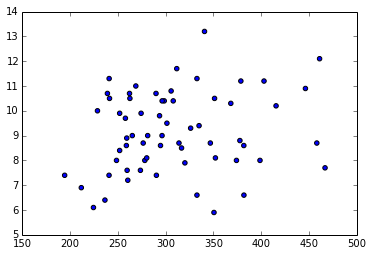
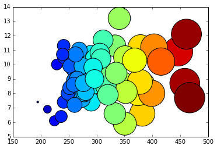

# Introduction

## What we are doing

<ul>
<li>We have a dataset containing health indicators by county</li>
<li>In the US, a &quot;county&quot; is an administrative unit that comprises multiple towns.</li>
<li>In this case we want to see if there is a relationship between two of these health indicators; such as obesity and cardiac mortality rate.</li>
<li>In order to expose that potential relationship we use a scatter plot, that display one valiable against the other.</li>
</ul>

## Setup

### Importing Modules

We start by importing the modules that will provide the basic functionalites for data manipulation and visualization.

### Plotting Modules

Here we import the modules that support ploting functionalities.

The following command indicates that we want the plots to be shown &quot;inline&quot; (in the web page)

<pre>%matplotlib inline</pre>

Then we import &quot;matplotlib&quot;. - This is a module that provides basic and advanced plotting functionalities. - More specifically, we import its &quot;pylab&quot; submodule. - We assign to it the alias &quot;plt&quot;, to make easier for us to type subsequent commands.

<pre>from matplotlib import pylab as plt</pre>

### Data Analysis Modules

We now import the &quot;pandas&quot; module. - It provides easy to use features for performing data analysis - It is well integrated with the plotting module - It provides support for reading data from many different file formats - We assign to it the alias &quot;pd&quot; to make easier for us to type commands later

<pre>import pandas as pd</pre>

We use the &quot;read_csv&quot; function from the pandas module, to read a csv (&quot;comma separated&quot;) file containing the health indicators data.

<pre>df = pd.read_csv(&#34;indicators.csv&#34;)</pre>

### Numerical Modules

Now we import the &quot;numpy&quot; module. - It provides support for numerical computation - In particular processing of vectors and matrices - We assign to it the alias &quot;np&quot; to make easier for us to type commands later

<pre>import numpy as np</pre>

## Data Exploration

### Data Frames

The pandas module reads data into a &quot;Data Frame&quot;, which is essentially a matrix where the columns are identified by names and the rows are identified by indices.

#### Columns

Here we start by taking a look at the columns of the data frame to see how it is organized. This is a typical first step when we need to get familiar with the content of a new data file.

<pre>df.columns</pre>

<pre>Index([u&#39;County Name&#39;, u&#39;County Code&#39;, u&#39;Region Name&#39;, u&#39;Indicator Number&#39;, u&#39;Indicator&#39;, u&#39;Total Event Counts&#39;, u&#39;Denominator&#39;, u&#39;Denominator Note&#39;, u&#39;Measure Unit&#39;, u&#39;Percentage/Rate&#39;, u&#39;95% CI&#39;, u&#39;Data Comments&#39;, u&#39;Data Years&#39;, u&#39;Data Sources&#39;, u&#39;Quartile&#39;, u&#39;Mapping Distribution&#39;, u&#39;Location&#39;], dtype=&#39;object&#39;)</pre>

#### Index - Row names

We can also look at the names of the rows, also known as the &quot;index&quot;. In this case, the index is a simple numerical ordering.

<pre>df.index</pre>

<pre>Int64Index([0, 1, 2, 3, 4, 5, 6, 7, 8, 9, 10, 11, 12, 13, 14, 15, 16, 17, 18, 19, 20, 21, 22, 23, 24, 25, 26, 27, 28, 29, 30, 31, 32, 33, 34, 35, 36, 37, 38, 39, 40, 41, 42, 43, 44, 45, 46, 47, 48, 49, 50, 51, 52, 53, 54, 55, 56, 57, 58, 59, 60, 61, 62, 63, 64, 65, 66, 67, 68, 69, 70, 71, 72, 73, 74, 75, 76, 77, 78, 79, 80, 81, 82, 83, 84, 85, 86, 87, 88, 89, 90, 91, 92, 93, 94, 95, 96, 97, 98, 99, ...], dtype=&#39;int64&#39;)</pre>

#### Pretty print

The pandas module provide a default pretty-print functionality that is also very helpful to get a sense of the content of the data frame. It has however the drawback that for data frames with many rows or many columns, scrolling may be needed to get a full picture of the data set. We invoke the pretty print by simply typing the name of the data frame.

<pre>df</pre>

<pre>         County Name  County Code            Region Name Indicator Number  \
0             Cayuga            5       Central New York               d1   
1           Cortland           11       Central New York               d1   
2           Herkimer           21       Central New York               d1   
3          Jefferson           22       Central New York               d1   
4              Lewis           23       Central New York               d1   
5            Madison           25       Central New York               d1   
6             Oneida           30       Central New York               d1   
7           Onondaga           31       Central New York               d1   
8             Oswego           35       Central New York               d1   
9       St. Lawrence           40       Central New York               d1   
10          Tompkins           50       Central New York               d1   
11  Central New York          103       Central New York               d1   
12           Chemung            7           Finger Lakes               d1   
13        Livingston           24           Finger Lakes               d1   
14            Monroe           26           Finger Lakes               d1   
15           Ontario           32           Finger Lakes               d1   
16          Schuyler           44           Finger Lakes               d1   
17            Seneca           45           Finger Lakes               d1   
18           Steuben           46           Finger Lakes               d1   
19             Wayne           54           Finger Lakes               d1   
20             Yates           57           Finger Lakes               d1   
21      Finger Lakes          102           Finger Lakes               d1   
22          Dutchess           13          Hudson Valley               d1   
23            Orange           33          Hudson Valley               d1   
24            Putnam           37          Hudson Valley               d1   
25          Rockland           39          Hudson Valley               d1   
26          Sullivan           48          Hudson Valley               d1   
27            Ulster           51          Hudson Valley               d1   
28       Westchester           55          Hudson Valley               d1   
29     Hudson Valley          106          Hudson Valley               d1   
30            Nassau           28         Nassau-Suffolk               d1   
31           Suffolk           47         Nassau-Suffolk               d1   
32    Nassau-Suffolk          108         Nassau-Suffolk               d1   
33             Bronx           58          New York City               d1   
34             Kings           59          New York City               d1   
35          New York           60          New York City               d1   
36            Queens           61          New York City               d1   
37          Richmond           62          New York City               d1   
38     New York City          107          New York City               d1   
39            Broome            3          New York-Penn               d1   
40          Chenango            8          New York-Penn               d1   
41             Tioga           49          New York-Penn               d1   
42     New York-Penn          104          New York-Penn               d1   
43    New York State          999         New York State               d1   
44            Albany            1  Northeastern New York               d1   
45           Clinton            9  Northeastern New York               d1   
46          Columbia           10  Northeastern New York               d1   
47          Delaware           12  Northeastern New York               d1   
48             Essex           15  Northeastern New York               d1   
49          Franklin           16  Northeastern New York               d1   
50            Fulton           17  Northeastern New York               d1   
51            Greene           19  Northeastern New York               d1   
52          Hamilton           20  Northeastern New York               d1   
53        Montgomery           27  Northeastern New York               d1   
54            Otsego           36  Northeastern New York               d1   
55        Rensselaer           38  Northeastern New York               d1   
56          Saratoga           41  Northeastern New York               d1   
57       Schenectady           42  Northeastern New York               d1   
58         Schoharie           43  Northeastern New York               d1   
59            Warren           52  Northeastern New York               d1   
                 ...          ...                    ...              ...   

                                            Indicator  Total Event Counts  \
0   Cardiovascular disease mortality rate per 100,000                 721   
1   Cardiovascular disease mortality rate per 100,000                 354   
2   Cardiovascular disease mortality rate per 100,000                 769   
3   Cardiovascular disease mortality rate per 100,000                1023   
4   Cardiovascular disease mortality rate per 100,000                 238   
5   Cardiovascular disease mortality rate per 100,000                 522   
6   Cardiovascular disease mortality rate per 100,000                2644   
7   Cardiovascular disease mortality rate per 100,000                3607   
8   Cardiovascular disease mortality rate per 100,000                1003   
9   Cardiovascular disease mortality rate per 100,000                1019   
10  Cardiovascular disease mortality rate per 100,000                 593   
11  Cardiovascular disease mortality rate per 100,000               12493   
12  Cardiovascular disease mortality rate per 100,000                 885   
13  Cardiovascular disease mortality rate per 100,000                 487   
14  Cardiovascular disease mortality rate per 100,000                5766   
15  Cardiovascular disease mortality rate per 100,000                 935   
16  Cardiovascular disease mortality rate per 100,000                 204   
17  Cardiovascular disease mortality rate per 100,000                 274   
18  Cardiovascular disease mortality rate per 100,000                 943   
19  Cardiovascular disease mortality rate per 100,000                 721   
20  Cardiovascular disease mortality rate per 100,000                 223   
21  Cardiovascular disease mortality rate per 100,000               10438   
22  Cardiovascular disease mortality rate per 100,000                2293   
23  Cardiovascular disease mortality rate per 100,000                2396   
24  Cardiovascular disease mortality rate per 100,000                 707   
25  Cardiovascular disease mortality rate per 100,000                2305   
26  Cardiovascular disease mortality rate per 100,000                 709   
27  Cardiovascular disease mortality rate per 100,000                1520   
28  Cardiovascular disease mortality rate per 100,000                7449   
29  Cardiovascular disease mortality rate per 100,000               17379   
30  Cardiovascular disease mortality rate per 100,000               14166   
31  Cardiovascular disease mortality rate per 100,000               11956   
32  Cardiovascular disease mortality rate per 100,000               26122   
33  Cardiovascular disease mortality rate per 100,000               10056   
34  Cardiovascular disease mortality rate per 100,000               19966   
35  Cardiovascular disease mortality rate per 100,000               10816   
36  Cardiovascular disease mortality rate per 100,000               18237   
37  Cardiovascular disease mortality rate per 100,000                4531   
38  Cardiovascular disease mortality rate per 100,000               63606   
39  Cardiovascular disease mortality rate per 100,000                2268   
40  Cardiovascular disease mortality rate per 100,000                 697   
41  Cardiovascular disease mortality rate per 100,000                 364   
42  Cardiovascular disease mortality rate per 100,000                3329   
43  Cardiovascular disease mortality rate per 100,000              164204   
44  Cardiovascular disease mortality rate per 100,000                2669   
45  Cardiovascular disease mortality rate per 100,000                 562   
46  Cardiovascular disease mortality rate per 100,000                 715   
47  Cardiovascular disease mortality rate per 100,000                 646   
48  Cardiovascular disease mortality rate per 100,000                 347   
49  Cardiovascular disease mortality rate per 100,000                 478   
50  Cardiovascular disease mortality rate per 100,000                 620   
51  Cardiovascular disease mortality rate per 100,000                 510   
52  Cardiovascular disease mortality rate per 100,000                  58   
53  Cardiovascular disease mortality rate per 100,000                 694   
54  Cardiovascular disease mortality rate per 100,000                 618   
55  Cardiovascular disease mortality rate per 100,000                1547   
56  Cardiovascular disease mortality rate per 100,000                1664   
57  Cardiovascular disease mortality rate per 100,000                1547   
58  Cardiovascular disease mortality rate per 100,000                 265   
59  Cardiovascular disease mortality rate per 100,000                 580   
                                                  ...                 ...   

    Denominator           Denominator Note Measure Unit  Percentage/Rate  \
0         79763  Average annual population         Rate            301.3   
1         48898  Average annual population         Rate            241.3   
2         63638  Average annual population         Rate            402.8   
3        117619  Average annual population         Rate            289.9   
4         26772  Average annual population         Rate            296.3   
5         72254  Average annual population         Rate            240.8   
6        233403  Average annual population         Rate            377.6   
7        462913  Average annual population         Rate            259.7   
8        121905  Average annual population         Rate            274.3   
9        111116  Average annual population         Rate            305.7   
10       101689  Average annual population         Rate            194.4   
11      1439971  Average annual population         Rate            289.2   
12        88667  Average annual population         Rate            332.7   
13        64445  Average annual population         Rate            251.9   
14       741224  Average annual population         Rate            259.3   
15       107369  Average annual population         Rate            290.3   
16        18475  Average annual population         Rate            368.1   
17        34833  Average annual population         Rate            262.2   
18        98192  Average annual population         Rate            320.1   
19        92833  Average annual population         Rate            258.9   
20        25095  Average annual population         Rate            296.2   
21      1271131  Average annual population         Rate            273.7   
22       296350  Average annual population         Rate            257.9   
23       377072  Average annual population         Rate            211.8   
24        99636  Average annual population         Rate            236.5   
25       309006  Average annual population         Rate            248.6   
26        76758  Average annual population         Rate            307.9   
27       182127  Average annual population         Rate            278.2   
28       953658  Average annual population         Rate            260.4   
29      2294607  Average annual population         Rate            252.5   
30      1347132  Average annual population         Rate            350.5   
31      1503547  Average annual population         Rate            265.1   
32      2850679  Average annual population         Rate            305.4   
33      1391466  Average annual population         Rate            240.9   
34      2534814  Average annual population         Rate            262.6   
35      1605625  Average annual population         Rate            224.5   
36      2261761  Average annual population         Rate            268.8   
37       476976  Average annual population         Rate            316.6   
38      8270641  Average annual population         Rate            256.4   
39       198087  Average annual population         Rate            381.7   
40        50405  Average annual population         Rate            460.9   
41        50744  Average annual population         Rate            239.1   
42       299236  Average annual population         Rate            370.8   
43     19461584  Average annual population         Rate            281.2   
44       302018  Average annual population         Rate            294.6   
45        81897  Average annual population         Rate            228.7   
46        62421  Average annual population         Rate            381.8   
47        47018  Average annual population         Rate            458.0   
48        38746  Average annual population         Rate            298.5   
49        51141  Average annual population         Rate            311.6   
50        55255  Average annual population         Rate            374.0   
51        49041  Average annual population         Rate            346.7   
52         4851  Average annual population         Rate            398.6   
53        49584  Average annual population         Rate            466.6   
54        61926  Average annual population         Rate            332.7   
55       158122  Average annual population         Rate            326.1   
56       220186  Average annual population         Rate            251.9   
57       153985  Average annual population         Rate            334.9   
58        32285  Average annual population         Rate            273.6   
59        65853  Average annual population         Rate            293.6   
            ...                        ...          ...              ...   

   95% CI Data Comments Data Years  \
0     NaN           NaN  2009-2011   
1     NaN           NaN  2009-2011   
2     NaN           NaN  2009-2011   
3     NaN           NaN  2009-2011   
4     NaN           NaN  2009-2011   
5     NaN           NaN  2009-2011   
6     NaN           NaN  2009-2011   
7     NaN           NaN  2009-2011   
8     NaN           NaN  2009-2011   
9     NaN           NaN  2009-2011   
10    NaN           NaN  2009-2011   
11    NaN           NaN  2009-2011   
12    NaN           NaN  2009-2011   
13    NaN           NaN  2009-2011   
14    NaN           NaN  2009-2011   
15    NaN           NaN  2009-2011   
16    NaN           NaN  2009-2011   
17    NaN           NaN  2009-2011   
18    NaN           NaN  2009-2011   
19    NaN           NaN  2009-2011   
20    NaN           NaN  2009-2011   
21    NaN           NaN  2009-2011   
22    NaN           NaN  2009-2011   
23    NaN           NaN  2009-2011   
24    NaN           NaN  2009-2011   
25    NaN           NaN  2009-2011   
26    NaN           NaN  2009-2011   
27    NaN           NaN  2009-2011   
28    NaN           NaN  2009-2011   
29    NaN           NaN  2009-2011   
30    NaN           NaN  2009-2011   
31    NaN           NaN  2009-2011   
32    NaN           NaN  2009-2011   
33    NaN           NaN  2009-2011   
34    NaN           NaN  2009-2011   
35    NaN           NaN  2009-2011   
36    NaN           NaN  2009-2011   
37    NaN           NaN  2009-2011   
38    NaN           NaN  2009-2011   
39    NaN           NaN  2009-2011   
40    NaN           NaN  2009-2011   
41    NaN           NaN  2009-2011   
42    NaN           NaN  2009-2011   
43    NaN           NaN  2009-2011   
44    NaN           NaN  2009-2011   
45    NaN           NaN  2009-2011   
46    NaN           NaN  2009-2011   
47    NaN           NaN  2009-2011   
48    NaN           NaN  2009-2011   
49    NaN           NaN  2009-2011   
50    NaN           NaN  2009-2011   
51    NaN           NaN  2009-2011   
52    NaN           NaN  2009-2011   
53    NaN           NaN  2009-2011   
54    NaN           NaN  2009-2011   
55    NaN           NaN  2009-2011   
56    NaN           NaN  2009-2011   
57    NaN           NaN  2009-2011   
58    NaN           NaN  2009-2011   
59    NaN           NaN  2009-2011   
      ...           ...        ...   

                                         Data Sources               Quartile  \
0   2009-2011 Vital Statistics Data as of February...   296.3 - &lt; 350.5 : Q3   
1   2009-2011 Vital Statistics Data as of February...  0 - &lt; 296.3 : Q1 &amp; Q2   
2   2009-2011 Vital Statistics Data as of February...           350.5 + : Q4   
3   2009-2011 Vital Statistics Data as of February...  0 - &lt; 296.3 : Q1 &amp; Q2   
4   2009-2011 Vital Statistics Data as of February...   296.3 - &lt; 350.5 : Q3   
5   2009-2011 Vital Statistics Data as of February...  0 - &lt; 296.3 : Q1 &amp; Q2   
6   2009-2011 Vital Statistics Data as of February...           350.5 + : Q4   
7   2009-2011 Vital Statistics Data as of February...  0 - &lt; 296.3 : Q1 &amp; Q2   
8   2009-2011 Vital Statistics Data as of February...  0 - &lt; 296.3 : Q1 &amp; Q2   
9   2009-2011 Vital Statistics Data as of February...   296.3 - &lt; 350.5 : Q3   
10  2009-2011 Vital Statistics Data as of February...  0 - &lt; 296.3 : Q1 &amp; Q2   
11  2009-2011 Vital Statistics Data as of February...                    NaN   
12  2009-2011 Vital Statistics Data as of February...   296.3 - &lt; 350.5 : Q3   
13  2009-2011 Vital Statistics Data as of February...  0 - &lt; 296.3 : Q1 &amp; Q2   
14  2009-2011 Vital Statistics Data as of February...  0 - &lt; 296.3 : Q1 &amp; Q2   
15  2009-2011 Vital Statistics Data as of February...  0 - &lt; 296.3 : Q1 &amp; Q2   
16  2009-2011 Vital Statistics Data as of February...           350.5 + : Q4   
17  2009-2011 Vital Statistics Data as of February...  0 - &lt; 296.3 : Q1 &amp; Q2   
18  2009-2011 Vital Statistics Data as of February...   296.3 - &lt; 350.5 : Q3   
19  2009-2011 Vital Statistics Data as of February...  0 - &lt; 296.3 : Q1 &amp; Q2   
20  2009-2011 Vital Statistics Data as of February...  0 - &lt; 296.3 : Q1 &amp; Q2   
21  2009-2011 Vital Statistics Data as of February...                    NaN   
22  2009-2011 Vital Statistics Data as of February...  0 - &lt; 296.3 : Q1 &amp; Q2   
23  2009-2011 Vital Statistics Data as of February...  0 - &lt; 296.3 : Q1 &amp; Q2   
24  2009-2011 Vital Statistics Data as of February...  0 - &lt; 296.3 : Q1 &amp; Q2   
25  2009-2011 Vital Statistics Data as of February...  0 - &lt; 296.3 : Q1 &amp; Q2   
26  2009-2011 Vital Statistics Data as of February...   296.3 - &lt; 350.5 : Q3   
27  2009-2011 Vital Statistics Data as of February...  0 - &lt; 296.3 : Q1 &amp; Q2   
28  2009-2011 Vital Statistics Data as of February...  0 - &lt; 296.3 : Q1 &amp; Q2   
29  2009-2011 Vital Statistics Data as of February...                    NaN   
30  2009-2011 Vital Statistics Data as of February...   296.3 - &lt; 350.5 : Q3   
31  2009-2011 Vital Statistics Data as of February...  0 - &lt; 296.3 : Q1 &amp; Q2   
32  2009-2011 Vital Statistics Data as of February...                    NaN   
33  2009-2011 Vital Statistics Data as of February...  0 - &lt; 296.3 : Q1 &amp; Q2   
34  2009-2011 Vital Statistics Data as of February...  0 - &lt; 296.3 : Q1 &amp; Q2   
35  2009-2011 Vital Statistics Data as of February...  0 - &lt; 296.3 : Q1 &amp; Q2   
36  2009-2011 Vital Statistics Data as of February...  0 - &lt; 296.3 : Q1 &amp; Q2   
37  2009-2011 Vital Statistics Data as of February...   296.3 - &lt; 350.5 : Q3   
38  2009-2011 Vital Statistics Data as of February...                    NaN   
39  2009-2011 Vital Statistics Data as of February...           350.5 + : Q4   
40  2009-2011 Vital Statistics Data as of February...           350.5 + : Q4   
41  2009-2011 Vital Statistics Data as of February...  0 - &lt; 296.3 : Q1 &amp; Q2   
42  2009-2011 Vital Statistics Data as of February...                    NaN   
43  2009-2011 Vital Statistics Data as of February...                    NaN   
44  2009-2011 Vital Statistics Data as of February...  0 - &lt; 296.3 : Q1 &amp; Q2   
45  2009-2011 Vital Statistics Data as of February...  0 - &lt; 296.3 : Q1 &amp; Q2   
46  2009-2011 Vital Statistics Data as of February...           350.5 + : Q4   
47  2009-2011 Vital Statistics Data as of February...           350.5 + : Q4   
48  2009-2011 Vital Statistics Data as of February...   296.3 - &lt; 350.5 : Q3   
49  2009-2011 Vital Statistics Data as of February...   296.3 - &lt; 350.5 : Q3   
50  2009-2011 Vital Statistics Data as of February...           350.5 + : Q4   
51  2009-2011 Vital Statistics Data as of February...   296.3 - &lt; 350.5 : Q3   
52  2009-2011 Vital Statistics Data as of February...           350.5 + : Q4   
53  2009-2011 Vital Statistics Data as of February...           350.5 + : Q4   
54  2009-2011 Vital Statistics Data as of February...   296.3 - &lt; 350.5 : Q3   
55  2009-2011 Vital Statistics Data as of February...   296.3 - &lt; 350.5 : Q3   
56  2009-2011 Vital Statistics Data as of February...  0 - &lt; 296.3 : Q1 &amp; Q2   
57  2009-2011 Vital Statistics Data as of February...   296.3 - &lt; 350.5 : Q3   
58  2009-2011 Vital Statistics Data as of February...  0 - &lt; 296.3 : Q1 &amp; Q2   
59  2009-2011 Vital Statistics Data as of February...  0 - &lt; 296.3 : Q1 &amp; Q2   
                                                  ...                    ...   

    Mapping Distribution                 Location  
0                      2  (42.940095, -76.560755)  
1                      1  (42.597101, -76.143291)  
2                      3  (43.070026, -74.994246)  
3                      1  (44.019295, -75.898971)  
4                      2  (43.785537, -75.446296)  
5                      1  (42.986917, -75.720031)  
6                      3  (43.149482, -75.361773)  
7                      1  (43.065629, -76.168033)  
8                      1    (43.39123, -76.31133)  
9                      2  (44.689468, -75.242045)  
10                     1  (42.461024, -76.478784)  
11                   NaN                      NaN  
12                     2  (42.116644, -76.812331)  
13                     1  (42.763754, -77.765392)  
14                     1  (43.161748, -77.620143)  
15                     1  (42.894571, -77.252045)  
16                     3   (42.38593, -76.872032)  
17                     1   (42.833627, -76.82753)  
18                     2  (42.270053, -77.324618)  
19                     1  (43.144336, -77.117995)  
20                     1  (42.634338, -77.078311)  
21                   NaN                      NaN  
22                     1  (41.686216, -73.840468)  
23                     1  (41.422459, -74.241929)  
24                     1   (41.41131, -73.717443)  
25                     1  (41.127287, -74.017033)  
26                     2  (41.705166, -74.711705)  
27                     1  (41.848374, -74.099412)  
28                     1  (41.039278, -73.805386)  
29                   NaN                      NaN  
30                     2  (40.715749, -73.601185)  
31                     1  (40.820237, -73.119032)  
32                   NaN                      NaN  
33                     1   (40.85589, -73.868294)  
34                     1   (40.65642, -73.950691)  
35                     1  (40.726966, -74.005966)  
36                     1  (40.749338, -73.789673)  
37                     2  (40.566763, -74.148102)  
38                   NaN                      NaN  
39                     3  (42.122015, -75.933191)  
40                     3  (42.481798, -75.570013)  
41                     1   (42.120252, -76.29595)  
42                   NaN                      NaN  
43                   NaN                      NaN  
44                     1  (42.678066, -73.814233)  
45                     1  (44.731944, -73.548883)  
46                     3  (42.276913, -73.682168)  
47                     3  (42.242972, -74.997944)  
48                     2  (44.166026, -73.685145)  
49                     2  (44.705699, -74.340621)  
50                     3   (43.06014, -74.331296)  
51                     2  (42.298326, -73.973376)  
52                     3  (43.618468, -74.395268)  
53                     3  (42.933637, -74.341972)  
54                     2  (42.564852, -75.060334)  
55                     2   (42.70098, -73.628669)  
56                     1   (43.00894, -73.786779)  
57                     2  (42.809233, -73.946838)  
58                     1  (42.643426, -74.434606)  
59                     1  (43.403024, -73.716044)  
                     ...                      ...  

[2733 rows x 17 columns]</pre>

### Extracting Columns

It is common to find that not all columns of a data frame are relevant or interesting for our data analysis. Therefore it is desirable to extact the interesting columns out of the dataframe, in order to focus on them in the subsequent steps.

Column extraction is made by passing to the data frame a list of column names.

<pre>selectedColumns = [&#39;County Name&#39;, &#39;County Code&#39;, &#39;Indicator Number&#39;, &#39;Indicator&#39;, &#39;Percentage/Rate&#39;]
df=df[selectedColumns]</pre>

### Showing selected rows

The data frame head() function prints by default the first 5 records of the dataset. It is a useful way to take a look at how the data is organized.

<pre>df.head()</pre>

<pre>  County Name  County Code Indicator Number  \
0      Cayuga            5               d1   
1    Cortland           11               d1   
2    Herkimer           21               d1   
3   Jefferson           22               d1   
4       Lewis           23               d1   

                                           Indicator  Percentage/Rate  
0  Cardiovascular disease mortality rate per 100,000            301.3  
1  Cardiovascular disease mortality rate per 100,000            241.3  
2  Cardiovascular disease mortality rate per 100,000            402.8  
3  Cardiovascular disease mortality rate per 100,000            289.9  
4  Cardiovascular disease mortality rate per 100,000            296.3  

[5 rows x 5 columns]</pre>

The head function also takes as argument the number of desired rows to print

<pre>df.head(3)</pre>

<pre>  County Name  County Code Indicator Number  \
0      Cayuga            5               d1   
1    Cortland           11               d1   
2    Herkimer           21               d1   

                                           Indicator  Percentage/Rate  
0  Cardiovascular disease mortality rate per 100,000            301.3  
1  Cardiovascular disease mortality rate per 100,000            241.3  
2  Cardiovascular disease mortality rate per 100,000            402.8  

[3 rows x 5 columns]</pre>

### Exploring Ranges

The pandas unique() function can be used to examine the unique values for a column. Let's illustrate this here, by first extracting a column (named 'Indicator') from the data frame, and then reducing the content of that column to the set of unique values.

The unique() function returns an array, so we us it to create a Series object, and then take advantage of its pretty-print functionality

<pre>indicators=pd.Series(df[&#39;Indicator&#39;].unique())
indicators</pre>

<pre>0     Cardiovascular disease mortality rate per 100,000
1     Cerebrovascular disease (stroke) mortality rat...
2     Age-adjusted cerebrovascular disease (stroke) ...
3     Age-adjusted cardiovascular disease mortality ...
4                  Cirrhosis mortality rate per 100,000
5     Age-adjusted cirrhosis mortality rate per 100,000
6                   Diabetes mortality rate per 100,000
7      Age-adjusted diabetes mortality rate per 100,000
8     Age-adjusted percentage of adults with physici...
9     Age-adjusted percentage of adults with physici...
10    Percentage of pregnant women in WIC who were p...
11    Percentage of pregnant women in WIC who were p...
12    Percentage of WIC mothers breastfeeding at lea...
13    Percentage overweight but not obese (85th-&lt;95t...
14    Percentage obese (95th percentile or higher) -...
15    Percentage overweight or obese (85th percentil...
16    Percentage overweight but not obese (85th-&lt;95t...
17    Percentage obese (95th percentile or higher ) ...
18    Percentage overweight or obese (85th percentil...
19    Percentage overweight but not obese (85th-&lt;95t...
20    Percentage obese (95th percentile or higher ) ...
21    Percentage overweight or obese (85th percentil...
22    Percentage obese (95th percentile or higher) c...
23    Percentage of children (aged 2-4 years) enroll...
24    Age-adjusted percentage of adults overweight o...
25    Age-adjusted percentage of adults obese (BMI 3...
26    Age-adjusted percentage of adults who did not ...
27    Age-adjusted percentage of adults eating 5 or ...
28    Cardiovascular disease hospitalization rate pe...
29            Cirrhosis hospitalization rate per 10,000
30    Age-adjusted cirrhosis hospitalization rate pe...
31    Diabetes hospitalization rate per 10,000 (prim...
32    Age-adjusted diabetes hospitalization rate per...
33    Diabetes hospitalization rate per 10,000 (any ...
34    Age-adjusted diabetes hospitalization rate per...
35    Age-adjusted cardiovascular disease hospitaliz...
36    Diabetes short-term complications hospitalizat...
37    Diabetes Short-term Complications Hospitalizat...
38    Cerebrovascular disease (stroke) hospitalizati...
39    Age-adjusted cerebrovascular disease (stroke) ...
dtype: object</pre>

Now that we have become familiar with the content of the data frame, we can proceed to generate plots of its values.

## Plotting

We start our plotting exercise by selecting two specific health indicators. For them, we extract their rate of occurence for all the counties in the data set, and then we plot, per county, the rate of one indicator versus the other.

This is what would typically be done to explore potential correlations between two health indicators

### Data Selection

From the list of unique health indicators, we choose two indicators of interest. We can do this by referring to them just by number.

<pre>indicator1=indicators[0]
indicator2=indicators[9]</pre>

We then print them out, as to verify which indicators we are plotting.

<pre>print &#34;1: &#34;,indicator1
print &#34;2: &#34;,indicator2</pre>

<pre>1:  Cardiovascular disease mortality rate per 100,000
2:  Age-adjusted percentage of adults with physician diagnosed diabetes
</pre>

### Data Extraction

Using each one of these indicators, we can now filter the data frame to extract the rows for which that specific indicator is present. We do this by taking advantage of a natural indexing provided by the pandas module.

<pre>data1=df[(df[&#39;Indicator&#39;]==indicator1)]
data2=df[(df[&#39;Indicator&#39;]==indicator2)]</pre>

We are essentially asking the data frame to return the list of records for which the value in the 'Indicator' column matches the specific value of one of our health indicators.

This produces two data frames, each one containing the data for that specific health indicator.

From them, we are particularly interested in the columns:

<ul>
<li>County Name</li>
<li>Percentage/Rate</li>
</ul>

We want to explore, for every county, how the percentage of occurrence of one health indicator, matches the percentage of occurence of the other health indicator. Again, we are exploring potential correlations between two health indicators.

Since the data is coming from a colection of records in a database, we must first extract them and index them by county, so that when we grab data from one indicator, we can be sure that we are matching it to another indicator for the same county.

<pre>data1_by_county = data1.set_index(data1[&#39;County Name&#39;])
data2_by_county = data2.set_index(data2[&#39;County Name&#39;])</pre>

Now that the indices are common, we can extract the column of data as a Series, for both indicators

<pre>rate1 = data1_by_county[&#39;Percentage/Rate&#39;]
rate2 = data2_by_county[&#39;Percentage/Rate&#39;]</pre>

Then we join both Series into a new Data Frame, and rename its columns to preserve the meaning of the health indicators

<pre>name1 = &#39;Cardiovascular&#39;
name2 = &#39;Diabetes&#39;

rates = pd.DataFrame([rate1,rate2],[name1,name2]).T</pre>

Real life data is messy. Here we can see that for some Counties we have missing data from one or both of the health indicators. We can drop those records from our analysis, using the dropna() function as follows

<pre>rates = rates.dropna()</pre>

And finally our data is organized in a consistent way, with two columns of data ready to be plot against each other in a scatter plot.

<pre>rates</pre>

<pre>                Cardiovascular  Diabetes
Albany                   294.6       8.6
Allegany                 313.9       8.7
Bronx                    240.9      11.3
Broome                   381.7       8.6
Cattaraugus              446.1      10.9
Cayuga                   301.3       9.5
Chautauqua               378.6      11.2
Chemung                  332.7      11.3
Chenango                 460.9      12.1
Clinton                  228.7      10.0
Columbia                 381.8       6.6
Cortland                 241.3      10.5
Delaware                 458.0       8.7
Dutchess                 257.9       9.7
Erie                     351.1      10.5
Essex                    298.5      10.4
Franklin                 311.6      11.7
Fulton                   374.0       8.0
Genesee                  340.6      13.2
Greene                   346.7       8.7
Hamilton                 398.6       8.0
Herkimer                 402.8      11.2
Jefferson                289.9      10.7
Kings                    262.6      10.5
Lewis                    296.3      10.4
Livingston               251.9       9.9
Madison                  240.8       7.4
Monroe                   259.3       8.9
Montgomery               466.6       7.7
Nassau                   350.5       5.9
New York                 224.5       6.1
New York State           281.2       9.0
Niagara                  415.4      10.2
Oneida                   377.6       8.8
Onondaga                 259.7       7.6
Ontario                  290.3       7.4
Orange                   211.8       6.9
Orleans                  352.0       8.1
Oswego                   274.3       9.9
Otsego                   332.7       6.6
Putnam                   236.5       6.4
Queens                   268.8      11.0
Rensselaer               326.1       9.3
Richmond                 316.6       8.5
Rockland                 248.6       8.0
Saratoga                 251.9       8.4
Schenectady              334.9       9.4
Schoharie                273.6       7.6
Schuyler                 368.1      10.3
Seneca                   262.2      10.7
St. Lawrence             305.7      10.8
Steuben                  320.1       7.9
Suffolk                  265.1       9.0
Sullivan                 307.9      10.4
Tioga                    239.1      10.7
Tompkins                 194.4       7.4
Ulster                   278.2       8.0
Warren                   293.6       9.8
Washington               280.2       8.1
Wayne                    258.9       8.6
                           ...       ...

[63 rows x 2 columns]</pre>

### Let's Plot

From our prepared Data Frame, we now extract the respective columns as Series

<pre>rate1 = rates[name1]
rate2 = rates[name2]</pre>

and pass them as arguments to the Matplotlib scatter function, that will generate the scatter plot

<pre>plt.scatter(rate1,rate2)</pre>

<pre>&lt;matplotlib.collections.PathCollection at 0x7f92ef730d90&gt;

</pre>

We can compare the values as well by using a bubble chart.

<pre>array1=np.array(rate1.tolist())
array1= array1[~np.isnan(array1)]
min=array1.min()
array_for_bubble=(array1-min+1)*10

plt.scatter(rate1, rate2, s=array_for_bubble, marker=&#39;o&#39;, c=array_for_bubble)</pre>

<pre>&lt;matplotlib.collections.PathCollection at 0x7f92ef5cddd0&gt;

</pre>

