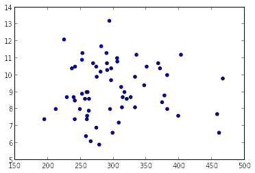
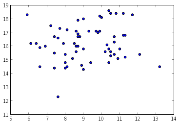
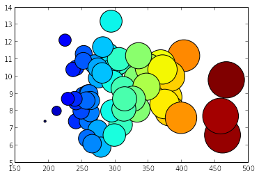

# Introduction 

## What we are doing

<ul>
<li>We have a dataset containing health indicators by county</li>
<li>In the US, a &quot;county&quot; is an administrative unit that comprises multiple towns.</li>
<li>In this case we want to see if there is a relationship between two of these health indicators; such as obesity and cardiac mortality rate.</li>
<li>In order to expose that potential relationship we use a scatter plot, that display one valiable against the other.</li>
</ul>

## Setup

### Importing Modules

We start by importing the modules that will provide the basic functionalites for data manipulation and visualization.

### Plotting Modules

Here we import the modules that support ploting functionalities.

The following command indicates that we want the plots to be shown &quot;inline&quot; (in the web page)

<pre>%matplotlib inline</pre>

Then we import &quot;matplotlib&quot;. - This is a module that provides basic and advanced plotting functionalities. - More specifically, we import its &quot;pylab&quot; submodule. - We assign to it the alias &quot;plt&quot;, to make easier for us to type subsequent commands.

<pre>from matplotlib import pylab as plt</pre>

### Data Analysis Modules

We now import the &quot;pandas&quot; module. - It provides easy to use feature for performing data analysis - It is well integrated with the plotting module - It provides support for reading data from many different file formats - We assign to it the alias &quot;pd&quot; to make easier for us to type commands later

<pre>import pandas as pd</pre>

We use the &quot;read_csv&quot; function from the pandas module, to read a csv (&quot;comma separated&quot;) file.

<pre>df = pd.read_csv(&#34;indicators.csv&#34;)</pre>

### Numerical Modules

Now we import the &quot;numpy&quot; module. - It provides support for numerical computation - In particular processing of vectors and matrices

<pre>import numpy as np</pre>

## Data Exploration

In this step we are taking a look at the columns of the dataset to see how it is organized

<pre>df.columns</pre>

<pre>Index([u&#39;County Name&#39;, u&#39;County Code&#39;, u&#39;Region Name&#39;, u&#39;Indicator Number&#39;, u&#39;Indicator&#39;, u&#39;Total Event Counts&#39;, u&#39;Denominator&#39;, u&#39;Denominator Note&#39;, u&#39;Measure Unit&#39;, u&#39;Percentage/Rate&#39;, u&#39;95% CI&#39;, u&#39;Data Comments&#39;, u&#39;Data Years&#39;, u&#39;Data Sources&#39;, u&#39;Quartile&#39;, u&#39;Mapping Distribution&#39;, u&#39;Location&#39;], dtype=&#39;object&#39;)</pre>

<ul>
<li>extract a subset of columns to make the data easier to work with</li>
</ul>

<pre>df=df[[&#39;County Name&#39;, &#39;County Code&#39;, &#39;Indicator Number&#39;, &#39;Indicator&#39;, &#39;Percentage/Rate&#39;]]</pre>

df.head() is a command that prints the first 5 records of the dataset. It is a useful way to take a look at how the data is organized.

<pre>df.head()</pre>

<pre>  County Name  County Code Indicator Number  \
0      Cayuga            5               d1   
1    Cortland           11               d1   
2    Herkimer           21               d1   
3   Jefferson           22               d1   
4       Lewis           23               d1   

                                           Indicator  Percentage/Rate  
0  Cardiovascular disease mortality rate per 100,000            301.3  
1  Cardiovascular disease mortality rate per 100,000            241.3  
2  Cardiovascular disease mortality rate per 100,000            402.8  
3  Cardiovascular disease mortality rate per 100,000            289.9  
4  Cardiovascular disease mortality rate per 100,000            296.3  

[5 rows x 5 columns]</pre>

The pandas unique() function can be used to examine the unique values for a column.

<pre>indicators=pd.Series(df[&#39;Indicator&#39;].unique())
print indicators</pre>

<pre>0     Cardiovascular disease mortality rate per 100,000
1     Cerebrovascular disease (stroke) mortality rat...
2     Age-adjusted cerebrovascular disease (stroke) ...
3     Age-adjusted cardiovascular disease mortality ...
4                  Cirrhosis mortality rate per 100,000
5     Age-adjusted cirrhosis mortality rate per 100,000
6                   Diabetes mortality rate per 100,000
7      Age-adjusted diabetes mortality rate per 100,000
8     Age-adjusted percentage of adults with physici...
9     Age-adjusted percentage of adults with physici...
10    Percentage of pregnant women in WIC who were p...
11    Percentage of pregnant women in WIC who were p...
12    Percentage of WIC mothers breastfeeding at lea...
13    Percentage overweight but not obese (85th-&lt;95t...
14    Percentage obese (95th percentile or higher) -...
15    Percentage overweight or obese (85th percentil...
16    Percentage overweight but not obese (85th-&lt;95t...
17    Percentage obese (95th percentile or higher ) ...
18    Percentage overweight or obese (85th percentil...
19    Percentage overweight but not obese (85th-&lt;95t...
20    Percentage obese (95th percentile or higher ) ...
21    Percentage overweight or obese (85th percentil...
22    Percentage obese (95th percentile or higher) c...
23    Percentage of children (aged 2-4 years) enroll...
24    Age-adjusted percentage of adults overweight o...
25    Age-adjusted percentage of adults obese (BMI 3...
26    Age-adjusted percentage of adults who did not ...
27    Age-adjusted percentage of adults eating 5 or ...
28    Cardiovascular disease hospitalization rate pe...
29            Cirrhosis hospitalization rate per 10,000
30    Age-adjusted cirrhosis hospitalization rate pe...
31    Diabetes hospitalization rate per 10,000 (prim...
32    Age-adjusted diabetes hospitalization rate per...
33    Diabetes hospitalization rate per 10,000 (any ...
34    Age-adjusted diabetes hospitalization rate per...
35    Age-adjusted cardiovascular disease hospitaliz...
36    Diabetes short-term complications hospitalizat...
37    Diabetes Short-term Complications Hospitalizat...
38    Cerebrovascular disease (stroke) hospitalizati...
39    Age-adjusted cerebrovascular disease (stroke) ...
dtype: object
</pre>

Define indicators to plot. We can choose indicators from the list and just refer to them by number. Print them out as to verify which indicators we are plotting.

<pre>indicator1=indicators[0]
indicator2=indicators[9]
indicator3=indicators[16]

print indicator1
print indicator2
print indicator3</pre>

<pre>Cardiovascular disease mortality rate per 100,000
Age-adjusted percentage of adults with physician diagnosed diabetes
Percentage overweight but not obese (85th-&lt;95th percentile) - Elementary students
</pre>

extract the data

<pre>data1=df[(df[&#39;Indicator&#39;]==indicator1)]
rate1=data1[&#39;Percentage/Rate&#39;]

data2=df[(df[&#39;Indicator&#39;]==indicator2)]
rate2=data2[&#39;Percentage/Rate&#39;]

data3=df[(df[&#39;Indicator&#39;]==indicator3)]
rate3=data3[&#39;Percentage/Rate&#39;]

</pre>

Real life data is messy. There is no guarentee the data is complete. In which case the lengths of the arrays may be different. In order to prevent potential errors find the minimum data length and use that many data points for all arrays.

<pre>n = np.array([len(rate1), len(rate2), len(rate3)]).min()

rate1=rate1[1:n]
rate2=rate2[1:n]
rate3=rate3[1:n]</pre>

Create the scatter plot.

<pre>plt.scatter(rate1, rate2)</pre>

<pre>&lt;matplotlib.collections.PathCollection at 0x644ce10&gt;

</pre>

Create a second scatter plot.

<pre>plt.scatter(rate2, rate3)</pre>

<pre>&lt;matplotlib.collections.PathCollection at 0x67e2910&gt;

</pre>

We can compare all three using a bubble chart.

<pre>array1=np.array(rate1.tolist())
array1= array1[~np.isnan(array1)]
min=array1.min()
array_for_bubble=(array1-min+1)*10

plt.scatter(rate1, rate2, s=array_for_bubble, marker=&#39;o&#39;, c=array_for_bubble)</pre>

<pre>&lt;matplotlib.collections.PathCollection at 0x6a05510&gt;

</pre>

<pre></pre>

<pre></pre>

