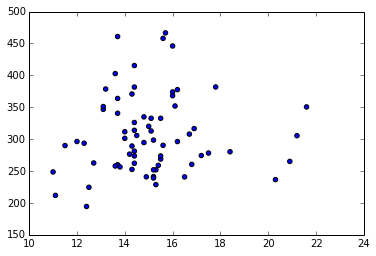

# Introduction 

What we are doing - we have a dataset containing health indicators by county - in this case we want to see if there is a relationship between two of them (such as obesity and cardiac mortality rate)

Setup - indicate we want the plots to be shown inline - import the matplotlib library - import pandas (explain what pandas is) - use pandas to read csv

<pre>%matplotlib inline
from matplotlib import pylab as plt
import pandas as pd
import numpy as np
df = pd.read_csv(&#34;indicators.csv&#34;)</pre>

In this step we are taking a look at the columns of the dataset to see how it is organized

<pre>df.columns</pre>

<pre>Index([u&#39;County Name&#39;, u&#39;County Code&#39;, u&#39;Region Name&#39;, u&#39;Indicator Number&#39;, u&#39;Indicator&#39;, u&#39;Total Event Counts&#39;, u&#39;Denominator&#39;, u&#39;Denominator Note&#39;, u&#39;Measure Unit&#39;, u&#39;Percentage/Rate&#39;, u&#39;95% CI&#39;, u&#39;Data Comments&#39;, u&#39;Data Years&#39;, u&#39;Data Sources&#39;, u&#39;Quartile&#39;, u&#39;Mapping Distribution&#39;, u&#39;Location&#39;], dtype=&#39;object&#39;)</pre>

<ul>
<li>extract a subset of columns to make the data easier to work with</li>
</ul>

<pre>df=df[[&#39;County Name&#39;, &#39;County Code&#39;, &#39;Indicator Number&#39;, &#39;Indicator&#39;, &#39;Percentage/Rate&#39;]]</pre>

df.head() is a command that prints the first 5 records of the dataset. It is a useful way to take a look at how the data is organized.

<pre>df.head()</pre>

<pre>  County Name  County Code Indicator Number  \
0      Cayuga            5               d1   
1    Cortland           11               d1   
2    Herkimer           21               d1   
3   Jefferson           22               d1   
4       Lewis           23               d1   

                                           Indicator  Percentage/Rate  
0  Cardiovascular disease mortality rate per 100,000            301.3  
1  Cardiovascular disease mortality rate per 100,000            241.3  
2  Cardiovascular disease mortality rate per 100,000            402.8  
3  Cardiovascular disease mortality rate per 100,000            289.9  
4  Cardiovascular disease mortality rate per 100,000            296.3  </pre>

<ul>
<li>extract cardiac mortality from the dataset</li>
<li>todo: explain how to inspect data and find the indicator numbers (somehow get a view of just the indicators and the corresponding numbers)</li>
</ul>

<pre>df_cardiac_mortality=df[(df[&#39;Indicator Number&#39;]==&#39;d1&#39;)]
df_cardiac_mortality.tail()</pre>

<pre>         County Name  County Code Indicator Number  \
66           Genesee           18               d1   
67           Niagara           29               d1   
68           Orleans           34               d1   
69           Wyoming           56               d1   
70  Western New York          101               d1   

                                            Indicator  Percentage/Rate  
66  Cardiovascular disease mortality rate per 100,000            340.6  
67  Cardiovascular disease mortality rate per 100,000            415.4  
68  Cardiovascular disease mortality rate per 100,000            352.0  
69  Cardiovascular disease mortality rate per 100,000            276.5  
70  Cardiovascular disease mortality rate per 100,000            363.8  </pre>

<ul>
<li>now extract just the rate so we can graph it</li>
</ul>

<pre>cardiac_rate=df_cardiac_mortality[&#39;Percentage/Rate&#39;]</pre>

<ul>
<li>extract obesity data</li>
</ul>

<pre>df_obesity=df[(df[&#39;Indicator Number&#39;]==&#39;g72&#39;)]
obesity_rate=df_obesity[&#39;Percentage/Rate&#39;]
df_obesity.tail()</pre>

<pre>           County Name  County Code Indicator Number  \
1553           Genesee           18              g72   
1554           Niagara           29              g72   
1555           Orleans           34              g72   
1556           Wyoming           56              g72   
1557  Western New York          101              g72   

                                              Indicator  Percentage/Rate  
1553  Percentage obese (95th percentile or higher) c...             13.7  
1554  Percentage obese (95th percentile or higher) c...             14.4  
1555  Percentage obese (95th percentile or higher) c...             16.1  
1556  Percentage obese (95th percentile or higher) c...             14.2  
1557  Percentage obese (95th percentile or higher) c...             13.7  </pre>

<pre>df_diabetes_hospitalization=df[(df[&#39;Indicator Number&#39;]==&#39;h12a&#39;)]
diabetes_hospitalization_rate=df_diabetes_hospitalization[&#39;Percentage/Rate&#39;]</pre>

<ul>
<li>now create a scatter plot</li>
</ul>

<pre>plt.scatter(obesity_rate, cardiac_rate)</pre>

<pre>&lt;matplotlib.collections.PathCollection at 0x7fb54303e090&gt;

</pre>

<pre>plt.scatter(obesity_rate, diabetes_hospitalization_rate)</pre>

<pre>&lt;matplotlib.collections.PathCollection at 0x7fb542fa5950&gt;

</pre>

<pre>plt.scatter(cardiac_rate, diabetes_hospitalization_rate)</pre>

<pre>&lt;matplotlib.collections.PathCollection at 0x7fb542ecc1d0&gt;

</pre>

We can compare all three using a bubble chart. Note we change the range of obesity from apr. 11 to 15, to 1 to 5. This is done so that we get a better range for the bubbles

<pre>obesity_array=np.array(obesity_rate.tolist())
obesity_array_no_nan= obesity_array[~np.isnan(obesity_array)]
min=obesity_array_no_nan.min()
obesity_array_for_bubble=(obesity_array-min+1)*10

plt.scatter(cardiac_rate, diabetes_hospitalization_rate, s=obesity_array_for_bubble, marker=&#39;o&#39;, c=obesity_array_for_bubble)</pre>

<pre>&lt;matplotlib.collections.PathCollection at 0x7fb542b5ff50&gt;

</pre>

