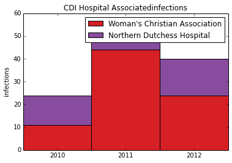
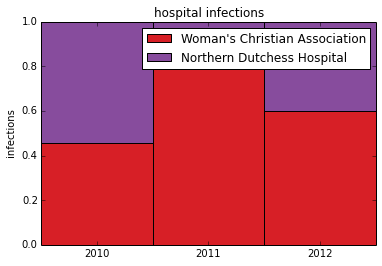

# Introduction  

This example shows how to plot a composition for data that is changing over time when there are only a small number of time periods. Two plots will be created.

<ul>
<li><strong>A Stacked Column Chart to show relative and absolute differences between groups. This chart also allows us to easily compare group totals.</strong></li>
<li><strong>A 100% Stacked Column Chart to show relative differences between groups.</strong></li>
</ul>
<h3 id="objectives">Objectives</h3>

The example uses yearly data on hospital acquired infections. Infection data from two hospitals is compared over 3 years. We want to:

<ul>
<li><strong>Load the data from a file into memory</strong></li>
<li><strong>Explore the data as to understand what it contains and how it is organized</strong></li>
<li><strong>Choose the data we want to plot</strong></li>
<li><strong>Choose an appropriate type of plot</strong></li>
<li><strong>Plot the data</strong></li>
</ul>

<h3 id="importing-modules">Importing Modules</h3>

In this example we need extra functionality for plotting (matplotlib), math (numpy) and data handling (pandas).

<pre>%matplotlib inline
from matplotlib import pylab as plt
import numpy as np
import pandas as pd  
</pre>

<pre>/usr/local/lib/python2.7/dist-packages/pandas/io/excel.py:626: UserWarning: Installed openpyxl is not supported at this time. Use &gt;=1.6.1 and &lt;2.0.0.
  .format(openpyxl_compat.start_ver, openpyxl_compat.stop_ver))
</pre>

First we read the data using the <code>Pandas</code> library. The pandas <code>read_csv</code> function reads the data from the file and places it in an appropriate data structure. If we are new to a library like <code>Pandas</code> then after we call a function it is useful to print the return type.

<pre>df = pd.read_csv(&#34;Hospital-Acquired_Infections__Beginning_2008.csv&#34;)
print type(df)</pre>

<pre>&lt;class &#39;pandas.core.frame.DataFrame&#39;&gt;
</pre>

The return type is a <code>pandas.core.frame.Dataframe</code>. Google is our friend here. When we google <code>pandas dataframe</code> one of the first results is a blog style tutorial http://www.gregreda.com/2013/10/26/working-with-pandas-dataframes/ that we can use to quickly gain knowledge we need to achieve a task. This blog contains a few useful tricks. For example we can take a look at the columns of the dataframe to get a feel for the information in the dataset.

<pre>df.columns</pre>

<pre>Index([u&#39;Facility Id&#39;, u&#39;Hospital Name&#39;, u&#39;Indicator Name&#39;, u&#39;Year&#39;, u&#39;Infections observed&#39;, u&#39;Infections predicted&#39;, u&#39;Denominator&#39;, u&#39;Indicator value&#39;, u&#39;Indicator Lower confidence limit&#39;, u&#39;Indicator Upper confidence limit&#39;, u&#39;Indicator units&#39;, u&#39;Comparison results&#39;, u&#39;Location 1&#39;], dtype=&#39;object&#39;)</pre>

The column names tell us what kind of data the structure contains. In this case data about Hospitals, Indicators, and Infections. It is also useful to look at the head (first 5 rows) of the data in order to learn more about how the data is organized.

<pre>df.head()</pre>

<pre>   Facility Id                   Hospital Name  \
0            0  New York State - All Hospitals   
1            0  New York State - All Hospitals   
2            0  New York State - All Hospitals   
3            0  New York State - All Hospitals   
4            0  New York State - All Hospitals   

                             Indicator Name  Year  Infections observed  \
0  SSI Overall Standardized Infection Ratio  2012                 1618   
1                        CDI Hospital Onset  2012                 9904   
2                 CLABSI Cardiothoracic ICU  2012                   67   
3                       CLABSI Coronary ICU  2012                   60   
4                        CLABSI Medical ICU  2012                  130   

   Infections predicted  Denominator  Indicator value  \
0                   NaN          NaN             1.00   
1                   NaN     11948043             8.29   
2                   NaN        75757             0.88   
3                   NaN        48540             1.24   
4                   NaN       107618             1.21   

   Indicator Lower confidence limit  Indicator Upper confidence limit  \
0                               NaN                               NaN   
1                               NaN                               NaN   
2                               NaN                               NaN   
3                               NaN                               NaN   
4                               NaN                               NaN   

                                     Indicator units Comparison results  \
0                                                NaN                NaN   
1  # hospital onset cases per 10,000 patient days...                NaN   
2                        # CLABSI per 1000 line days                NaN   
3                        # CLABSI per 1000 line days                NaN   
4                        # CLABSI per 1000 line days                NaN   

  Location 1  
0        NaN  
1        NaN  
2        NaN  
3        NaN  
4        NaN  </pre>

We have a column called 'Hospital Name'. We want to compare data for different hospitals. So it is useful to look at the unique values of this column in order to determine how many and which hospitals the data contains. This is the type of coding we can do in one line (once we get familiar with the libraries). Here we use multiple lines as to make it clear what is happening.

<ul>
<li><strong>We first extract just the <code>Hospital Name</code> column</strong></li>
<li><strong>We check the the type, it is a data series</strong></li>
<li><strong>We then ask for only the unique values</strong></li>
<li><strong>We again check the type, it is an array this time</strong></li>
<li><strong>We convert this array back to a series (mainly to take advantage of pandas 'pretty' <code>print</code> styles)</strong></li>
<li><strong>Finally we print this series as to find out how many unique hospitals are in the data.</strong></li>
</ul>

<pre>hospitalNameExtracted=df[&#39;Hospital Name&#39;]
print type(hospitalNameExtracted)
hospitalNamesUnique=df[&#39;Hospital Name&#39;].unique()
print type(hospitalNamesUnique)
hospitalNames=pd.Series(hospitalNamesUnique)
print hospitalNames</pre>

<pre>&lt;class &#39;pandas.core.series.Series&#39;&gt;
&lt;type &#39;numpy.ndarray&#39;&gt;
0                        New York State - All Hospitals
1                        Albany Medical Center Hospital
2                              Albany Memorial Hospital
3                                    St Peters Hospital
4     Memorial Hosp of Wm F &amp; Gertrude F Jones A/K/A...
5             Our Lady of Lourdes Memorial Hospital Inc
6     United Health Services Hospitals Inc. - Wilson...
7                                Olean General Hospital
8                             Auburn Community Hospital
9                              Brooks Memorial Hospital
10                        Woman&#39;s Christian Association
11               TLC Health Network Lake Shore Hospital
12                           Arnot Ogden Medical Center
13                                  St Josephs Hospital
14                       Chenango Memorial Hospital Inc
...
167               Peninsula Hospital Center- Closed 2012
168                               Queens Hospital Center
169               St. Johns Queens Hospital- Closed 2009
170                 St Johns Episcopal Hospital So Shore
171         New York Hospital Medical Center   of Queens
172                                Forest Hills Hospital
173    Mount Sinai Hospital - Mount Sinai Hospital of...
174              Woodhull Medical &amp; Mental Health Center
175                   Richmond University Medical Center
176                  Staten Island University Hosp-North
177                  North General Hospital- Closed 2010
178          SVCMC Mary Immaculate Hospital- Closed 2009
179    Montefiore Med Center - Jack D Weiler Hosp of ...
180                   Millard Fillmore Suburban Hospital
181      New York Presbyterian Hospital - Allen Hospital
Length: 182, dtype: object
</pre>

In this step we assign two hospitals from the list to the variables 'hospital1' and 'hospital2'. It is good practice to use variables for the hospital names. If we want to graph data from different hospitals later, we only have to change the below block.

<pre>hospital1=hospitalNames[10]
hospital2=hospitalNames[20]

print hospital1+&#34; : &#34;+hospital2</pre>

<pre>Woman&#39;s Christian Association : Northern Dutchess Hospital
</pre>

We extract the data for hospital1 and hospital2 and check to verify the type of the subdata. It should still be a dataframe.

<pre>hospitalData1=df[(df[&#39;Hospital Name&#39;]==hospital1)]
hospitalData2=df[(df[&#39;Hospital Name&#39;]==hospital2)]

type(hospitalData1)</pre>

<pre>pandas.core.frame.DataFrame</pre>

Now we take a look at the data again. Data can be messy. There is no guarantee the data from different hospitals will be consistent. So we need to check what the dataframe contains. Specifically we want to know what years data was collected, and what Indicators were observed. As before it is handy to use the unique() function to take a look at the unique values of a column.

<pre>print hospitalData1[&#39;Year&#39;].unique()
print hospitalData2[&#39;Year&#39;].unique()
print
print hospitalData2[&#39;Indicator Name&#39;].unique()
print
print hospitalData2[&#39;Indicator Name&#39;].unique()</pre>

<pre>[2012 2011 2010 2009 2008]
[2012 2011 2010 2009 2008]

[&#39;SSI Overall Standardized Infection Ratio&#39; &#39;SSI Hysterectomy&#39; &#39;SSI Hip&#39;
 &#39;SSI Colon&#39; &#39;CLABSI Overall Standardized Infection Ratio&#39;
 &#39;CLABSI Medical Surgical ICU Nonteaching&#39; &#39;CDI Hospital Onset&#39;
 &#39;CDI Hospital Associated&#39; &#39;CDI Community Onset&#39;]

[&#39;SSI Overall Standardized Infection Ratio&#39; &#39;SSI Hysterectomy&#39; &#39;SSI Hip&#39;
 &#39;SSI Colon&#39; &#39;CLABSI Overall Standardized Infection Ratio&#39;
 &#39;CLABSI Medical Surgical ICU Nonteaching&#39; &#39;CDI Hospital Onset&#39;
 &#39;CDI Hospital Associated&#39; &#39;CDI Community Onset&#39;]
</pre>

In this case we see we have data for years 2008 to 2012 and several infection 'Indicators'. So let's us the 'CDI Hospital Associated' category as our indicator and extract that subset of data.

<pre>indicator=&#39;CDI Hospital Associated&#39;

infections1=hospitalData1[hospitalData1[&#39;Indicator Name&#39;]==indicator]
infections2=hospitalData2[hospitalData2[&#39;Indicator Name&#39;]==indicator]</pre>

Here we define colors for the plots.

<pre>color1=&#39;#d71f26&#39;
color2=&#39;#874c9d&#39;</pre>

Now we can use a stacked collumn chart to Create a stacked column chart based on this example (http://matplotlib.org/examples/pylab_examples/bar_stacked.html). Stacked column charts are a useful way to compare elements within a group and at the same time compare totals. In this example we compare infections from two hospitals over 3 years. At the same time we can quickly see trends in the total number of infections from both hospitals.

<pre>p1=plt.bar([1,2,3], infections1[&#39;Infections observed&#39;], 1, color=color1)
p2=plt.bar([1,2,3], infections2[&#39;Infections observed&#39;], 1, color=color2, bottom=infections1[&#39;Infections observed&#39;])

plt.ylabel(&#39;infections&#39;)
plt.title(indicator+&#39;infections&#39;)
plt.xticks([1.5,2.5,3.5],(&#39;2010&#39;, &#39;2011&#39;, &#39;2012&#39;) )
plt.legend( (p1[0], p2[0]), (hospital1, hospital2) )</pre>

<pre>&lt;matplotlib.legend.Legend at 0x3f58e10&gt;

</pre>

To visualize relative changes we can normalize the data and plot a stacked 100% area chart. The first step is to convert the panda dataframe column to an array so we can perform math operations on it using numpy.

<pre>array1=np.array(infections1[&#39;Infections observed&#39;].tolist())
array2=np.array(infections2[&#39;Infections observed&#39;].tolist())</pre>

We want the total height of eached stacked column to be 1 (or 100%). To achieve this we divide each array by the sum of both arrays. Afterwards we print out the arrays so we can confirm the data is correct.

<pre>array1_normal=array1/(array1+array2)
array2_normal=array2/(array1+array2)

print array1_normal
print array2_normal</pre>

<pre>[ 0.45833333  0.83018868  0.6       ]
[ 0.54166667  0.16981132  0.4       ]
</pre>

Now Plot the normalized data in a stacked column chart. This gives us the stacked 100% column chart which can be used to see relative differences

<pre>p1=plt.bar([1,2,3], array1_normal, 1, color=color1)
p2=plt.bar([1,2,3], array2_normal, 1, color=color2, bottom=array1_normal)

plt.ylabel(&#39;infections&#39;)
plt.title(&#39;hospital infections&#39;)
plt.xticks([1.5,2.5,3.5],(&#39;2010&#39;, &#39;2011&#39;, &#39;2012&#39;) )
#plt.yticks(np.arange(0,81,10))
plt.legend( (p1[0], p2[0]), (hospital1, hospital2) )</pre>

<pre>&lt;matplotlib.legend.Legend at 0x3f83510&gt;

</pre>

<pre></pre>

