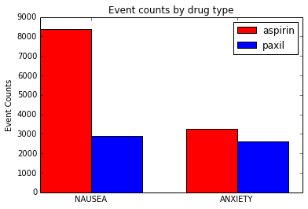
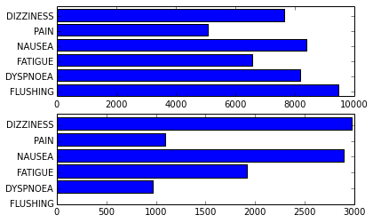
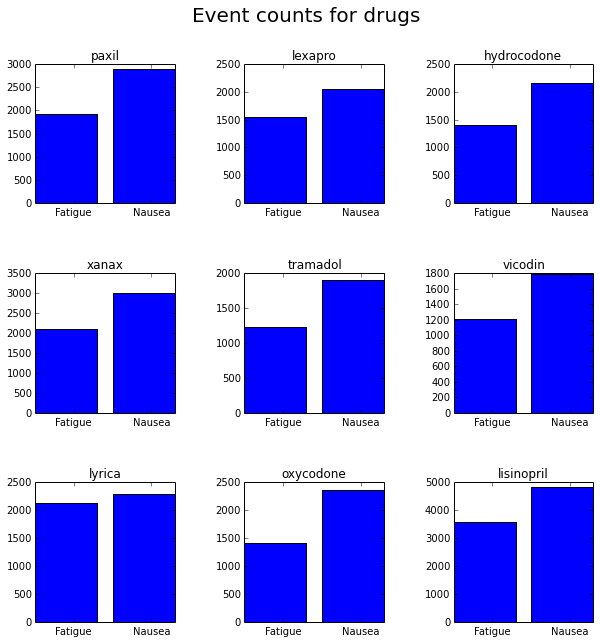

# Visualizing FDA Data 

In this example we use the open FDA api to get information about drug side effects. We want to compare side effects between different drugs. We will show 3 different graphs.

-Few categories (compare 2 or 3 drugs) - Few items (compare 3 drugs for 2 side effects) create a column chart - Many items (compare 2 drugs for many side effects) create a bar chart -Many categories - In this example we will create a table of embedded charts to compare side effects between many drugs

<pre>import pandas as pd
import numpy as np
import json as js
import urllib2 as ulib
import simplejson
import matplotlib.pyplot as plt
from operator import itemgetter

%matplotlib inline </pre>

<pre>/usr/local/lib/python2.7/dist-packages/pandas/io/excel.py:626: UserWarning: Installed openpyxl is not supported at this time. Use &gt;=1.6.1 and &lt;2.0.0.
  .format(openpyxl_compat.start_ver, openpyxl_compat.stop_ver))
</pre>

<pre># try reading with pandas... This seems to raise an error...
#fdaquery=pd.read_json(&#34;http://api.fda.gov/drug/event.json?search=patient.drug.openfda.pharm_class_epc:\&#34;nonsteroidal+anti-inflammatory+drug\&#34;&amp;count=patient.reaction.reactionmeddrapt.exact&#34;)</pre>

define a function that uses the open fda api to get drug data

<pre>def get_drug_data(drugname):
    # form a request
    request_string=&#39;http://api.fda.gov/drug/event.json?search=patient.drug.medicinalproduct:&#39;+drugname+&#39;&amp;count=patient.reaction.reactionmeddrapt.exact&#39;
    
    request=ulib.Request(request_string)

    # open the url
    opener = ulib.build_opener()
    f = opener.open(request)

    # load as json
    fda_data=simplejson.load(f)
    
    # return the results
    return fda_data[&#39;results&#39;]</pre>

define a function that will return the count for a symptom

<pre>def get_symptom_count(symptom_list, symptom):
    try:
        index=map(itemgetter(&#39;term&#39;), symptom_list).index(symptom)
        return symptom_list[index].get(&#39;count&#39;)
    except ValueError:
        return 0
    </pre>

<pre>drugname1=&#39;aspirin&#39;
drugname2=&#39;paxil&#39;

druglist1=get_drug_data(drugname1)
druglist2=get_drug_data(drugname2)
#drug3=get_drug_data(&#39;xanax&#39;)

symptom1=&#39;NAUSEA&#39;
symptom2=&#39;ANXIETY&#39;

aspirin_list=[get_symptom_count(druglist1, symptom1), get_symptom_count(druglist1, symptom2)]
paxil_list=[get_symptom_count(druglist2, symptom1), get_symptom_count(druglist2, symptom2)]

</pre>

This example shows a plot that compares 2 drugs for 2 side effects (reference: http://matplotlib.org/examples/api/barchart_demo.html)

<pre>print aspirin_list
print paxil_list

ind=np.asarray([1,2])
width = 0.35 

fig, ax = plt.subplots()

rects1 = plt.bar(ind, aspirin_list, width, color=&#39;r&#39;)
rects2 = plt.bar(ind+width, paxil_list, width, color=&#39;b&#39;)

ax.set_ylabel(&#39;Event Counts&#39;)
ax.set_title(&#39;Event counts by drug type&#39;)

ax.set_xticks(ind+width)
ax.set_xticklabels( (symptom1, symptom2) )

ax.legend( (rects1[0], rects2[0]), (drugname1, drugname2) )

plt.show()</pre>

<pre>[8382, 3267]
[2897, 2605]

</pre>

This example shows a plot that compares 2 drugs for many side effects.

<pre>symptoms=[&#39;FLUSHING&#39;, &#39;DYSPNOEA&#39;, &#39;FATIGUE&#39;, &#39;NAUSEA&#39;, &#39;PAIN&#39;, &#39;DIZZINESS&#39;]

count1=[]
count2=[]

for symptom in symptoms:
    count1.append(get_symptom_count(druglist1, symptom))
    count2.append(get_symptom_count(druglist2, symptom))
    
ind=np.arange(len(count1))
                  
plt.subplot(211)
plt.barh(ind, count1)

ax=plt.gca()
ax.set_yticks(ind+.3)
ax.set_yticklabels(symptoms)

plt.subplot(212)
plt.barh(ind, count2)

ax=plt.gca()
ax.set_yticks(ind+.3)
ax.set_yticklabels(symptoms)

plt.show()</pre>

<pre>

</pre>

This example shows a table with embedded charts to compare many drugs for 2 side effects

<pre>symptom1=&#39;FATIGUE&#39;
symptom2=&#39;NAUSEA&#39;

ind=np.asarray([1,2])

drugs=[&#39;paxil&#39;, &#39;lexapro&#39;, &#39;hydrocodone&#39;, &#39;xanax&#39;, &#39;tramadol&#39;, &#39;vicodin&#39;, &#39;lyrica&#39;, &#39;oxycodone&#39;, &#39;lisinopril&#39;]

plotpos=[331, 332, 333, 334, 335, 336, 337, 338, 339]

fig, axes = plt.subplots(nrows=3, ncols=3, figsize=(25,25))
#fig.tight_layout()

for drug, pos in zip(drugs,plotpos):
    druglist=get_drug_data(drug)
    counts=[get_symptom_count(druglist, symptom1), get_symptom_count(druglist, symptom2)]
    plt.subplot(pos)
    plt.bar(ind, counts)
    ax=plt.gca()
    ax.set_xticks(ind+.5)
    ax.set_xticklabels([&#39;Fatigue&#39;,&#39;Nausea&#39;])
    ax.set_title(drug)
    
    
fig.set_size_inches(10,10)    
plt.subplots_adjust(wspace=.5,hspace=.5)
plt.suptitle(&#39;Event counts for drugs&#39;, fontsize=20)
plt.show()
            
            
    
    </pre>

<pre>

</pre>

<pre></pre>

