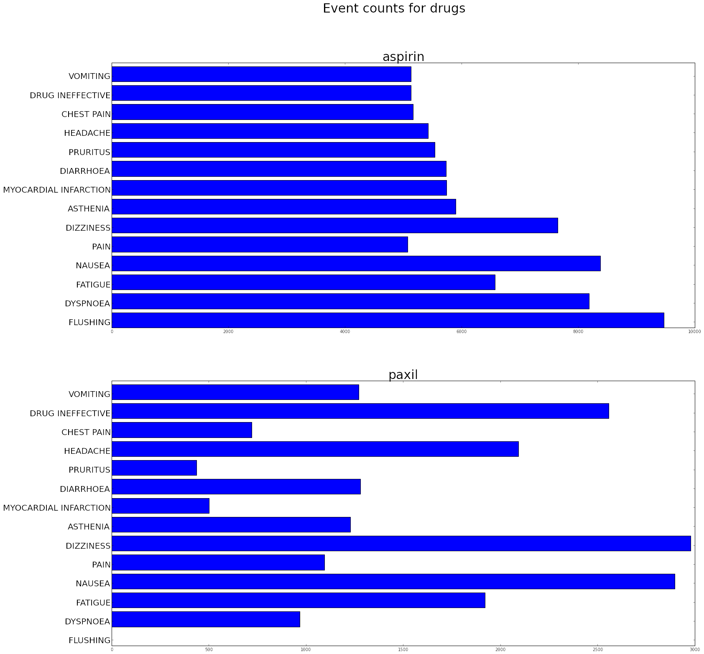
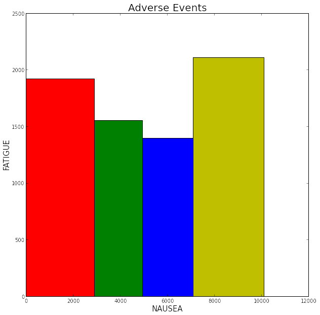

# Visualizing FDA Data 

In this example we use the openFDA API to get information about drug side effects. We want to compare side effects between different drugs. We will show 4 different graphs.

Few categories (compare 2 or 3 drugs)

<ul>
<li>Few items (compare 3 drugs for 2 side effects) create a column chart</li>
<li>Many items (compare 2 drugs for many side effects) create a bar chart</li>
</ul>

Many categories

<ul>
<li>In this example we will create a table of embedded charts to compare side effects between many drugs</li>
<li>We use a variable width column chart to compare side effects between a few drugs (4 or 5)</li>
</ul>

Many categories, many items

<ul>
<li>In this example we will use a 3D bar chart to compare many side effects between many drugs</li>
</ul>

<h4 id="objectives">Objectives</h4>
<ul>
<li>use an API to retrieve data</li>
<li>define small functions that we can re-use</li>
<li>select the appropriate chart depending on how many items and categories we have</li>
<li>use matplotlib to create the charts</li>
</ul>

<pre>import json as js
import urllib2 as ulib
import simplejson
import matplotlib.pyplot as plt
import numpy as np
from operator import itemgetter

%matplotlib inline   </pre>

<pre># try reading with pandas... This seems to raise an error...
#fdaquery=pd.read_json(&#34;http://api.fda.gov/drug/event.json?search=patient.drug.openfda.pharm_class_epc:\&#34;nonsteroidal+anti-inflammatory+drug\&#34;&amp;count=patient.reaction.reactionmeddrapt.exact&#34;)</pre>

Here we use the openFDA api to get drug data.

<ul>
<li>First we define a request string following the documentation on the openFDA site (https://open.fda.gov/api/reference/). Note that most of the request string is static. However the drugname is passed in as a parameter.</li>
<li>We use urlib2 to open the url and get the response</li>
<li>We use simplejson to load the response as a json object.</li>
</ul>

<pre># form a request
request_string=&#39;http://api.fda.gov/drug/event.json?search=patient.drug.medicinalproduct:aspirin&amp;count=patient.reaction.reactionmeddrapt.exact&#39;

response=ulib.urlopen(request_string)

# load as json
fda_data=simplejson.load(response)</pre>

It is useful to take a look at the type of the result.

<pre>print type(fda_data)</pre>

<pre>&lt;type &#39;dict&#39;&gt;
</pre>

It should be a dictionary. So it will also be useful to take a look at the keys

<pre>for key, value in fda_data.iteritems():
    print key</pre>

<pre>meta
results
</pre>

It appears we have meta-data and results. Get the results and print out the type

<pre>print type(fda_data[&#39;results&#39;])</pre>

<pre>&lt;type &#39;list&#39;&gt;
</pre>

It's a list so lets take a look at the type of and value of the first item in the list.

<pre>print &#34;type of first item: &#34;+str(type(fda_data[&#39;results&#39;][0]))+&#34; value of first item: &#34;+str(fda_data[&#39;results&#39;][0])</pre>

<pre>type of first item: &lt;type &#39;dict&#39;&gt; value of first item: {&#39;count&#39;: 9470, &#39;term&#39;: &#39;FLUSHING&#39;}
</pre>

Each item in the list is a dictionary containing a 'count' (number of adverse events) and a 'term' (name of adverse event). Let's print out the first 5 values of the list. This is done to get a better feel for the data. For example what type of symptoms do we find in the list? (if you are following along interactively try printing out more than 5 values to get a better look at the data).

<pre>fda_list=fda_data[&#39;results&#39;]

for x in range(0, min(10, len(fda_list))):
    entry=fda_list[x]
    print &#39;term: &#39;+str(entry[&#39;term&#39;])+&#34; count &#34;+str(entry[&#39;count&#39;])
    
</pre>

<pre>term: FLUSHING count 9470
term: NAUSEA count 8382
term: DYSPNOEA count 8189
term: DIZZINESS count 7654
term: FATIGUE count 6577
term: ASTHENIA count 5903
term: MYOCARDIAL INFARCTION count 5742
term: DIARRHOEA count 5736
term: PRURITUS count 5540
term: HEADACHE count 5429
</pre>

Now that we know a little bit about our data we put that knowledge to use by writing a function that we can re-use. The function forms a request string using a 'drugname' that is passed in as a variable. It then opens the url and uses simplejson to load the response. We return only the 'results' part (remember this is a list of dictionary data representing adverse events).

<pre>def get_drug_adverse_event_data(drugname):
    # form a request
    request_string=&#39;http://api.fda.gov/drug/event.json?search=patient.drug.medicinalproduct:&#39;+drugname+&#39;&amp;count=patient.reaction.reactionmeddrapt.exact&#39;
    
    response=ulib.urlopen(request_string)
    
    # load as json
    fda_data=simplejson.load(response)
    
    # return the results
    return fda_data[&#39;results&#39;]</pre>

We also define a function that will return the event count for a adverse event. TODO: explain the 'map' approach to get the index OR make it less elegant (but more understandable) by just looping and searching for the symptom we want)

<pre>def get_event_count(event_list, event):
    try:
        index=map(itemgetter(&#39;term&#39;), event_list).index(event)
        return event_list[index].get(&#39;count&#39;)
    except ValueError:
        return 0
    </pre>

So now that we have a function that returns a list of adverse events for a specific drug let's use it to get information about two different drugs.

<pre>drugname1=&#39;aspirin&#39;
drugname2=&#39;paxil&#39;

druglist1=get_drug_adverse_event_data(drugname1)
druglist2=get_drug_adverse_event_data(drugname2)</pre>

Next, use the 'get_event_count' function to get adverse event accounts for two different types of events. We print out the two lists to make sure the data is in the form we expect. Each list should contain 2 event counts (2 integers)

<pre>event1=&#39;NAUSEA&#39;
event2=&#39;ANXIETY&#39;

aspirin_list=[get_event_count(druglist1, event1), get_event_count(druglist1, event2)]
paxil_list=[get_event_count(druglist2, event1), get_event_count(druglist2, event2)]

print aspirin_list
print paxil_list</pre>

<pre>[8382, 3267]
[2897, 2605]
</pre>

Now that we've read the data we can plot it. We follow this reference: http://matplotlib.org/examples/api/barchart_demo.html. The first step is to define the horizontal indices for the plots. It's useful to define this as a numpy array so we can perform calculations with it. We define a width that will be used for later calculations. We also get a reference to the axis which is used to place labels and ticks.

We use <code>plyplot.bar</code> to draw the plots. We pass in indexes to plot at, values to plot, width of the bars and the color. Note that in the second call we add <code>width</code> to the index. Since <code>ind</code> was defined as a <code>numpy</code> array we can perform mathematical operations on it.

Finally we add labels, a title, ticks and a legend then show the plot.

<pre>ind=np.asarray([1,2])
width = 0.35 
fig, ax = plt.subplots()

rects1 = plt.bar(ind, aspirin_list, width, color=&#39;r&#39;)
rects2 = plt.bar(ind+width, paxil_list, width, color=&#39;b&#39;)

ax.set_ylabel(&#39;Event Counts&#39;)
ax.set_title(&#39;Event counts by drug type&#39;)

ax.set_xticks(ind+width)
ax.set_xticklabels( (event1, event2) )

ax.legend( (rects1[0], rects2[0]), (drugname1, drugname2) )

plt.show()</pre>

<pre>

</pre>

This example shows a plot that compares 2 drugs for many side effects.

<pre>events=[&#39;FLUSHING&#39;, &#39;DYSPNOEA&#39;, &#39;FATIGUE&#39;, &#39;NAUSEA&#39;, &#39;PAIN&#39;, &#39;DIZZINESS&#39;]

count1=[]
count2=[]

for event in events:
    count1.append(get_event_count(druglist1, event))
    count2.append(get_event_count(druglist2, event))
    
ind=np.arange(len(count1))
                  
plt.subplot(211)
plt.barh(ind, count1)

ax=plt.gca()
ax.set_yticks(ind+.3)
ax.set_yticklabels(events)

plt.subplot(212)
plt.barh(ind, count2)

ax=plt.gca()
ax.set_yticks(ind+.3)
ax.set_yticklabels(events)

plt.show()</pre>

<pre>

</pre>

This example shows a table with embedded charts to compare many drugs for 2 side effects

<pre>event1=&#39;FATIGUE&#39;
event2=&#39;NAUSEA&#39;

ind=np.asarray([1,2])

drugs=[&#39;paxil&#39;, &#39;lexapro&#39;, &#39;hydrocodone&#39;, &#39;xanax&#39;, &#39;tramadol&#39;, &#39;vicodin&#39;, &#39;lyrica&#39;, &#39;oxycodone&#39;, &#39;lisinopril&#39;]

plotpos=[331, 332, 333, 334, 335, 336, 337, 338, 339]

fig, axes = plt.subplots(nrows=3, ncols=3, figsize=(25,25))

for drug, pos in zip(drugs,plotpos):
    druglist=get_drug_adverse_event_data(drug)
    counts=[get_event_count(druglist, event1), get_event_count(druglist, event2)]
    plt.subplot(pos)
    plt.bar(ind, counts)
    ax=plt.gca()
    ax.set_xticks(ind+.5)
    ax.set_xticklabels([&#39;Fatigue&#39;,&#39;Nausea&#39;])
    ax.set_title(drug)
    
    
fig.set_size_inches(10,10)    
plt.subplots_adjust(wspace=.5,hspace=.5)
plt.suptitle(&#39;Event counts for drugs&#39;, fontsize=20)
plt.show()
            
            
    
    </pre>

<pre>

</pre>

Variable width collumn chart

<pre>event1=&#39;FATIGUE&#39;
event2=&#39;NAUSEA&#39;

ind=np.asarray([1,2])

drugs=[&#39;paxil&#39;, &#39;lexapro&#39;, &#39;hydrocodone&#39;, &#39;xanax&#39;]
colors=[&#39;r&#39;, &#39;g&#39;, &#39;b&#39;, &#39;y&#39;]

fig, axes = plt.subplots(figsize=(10,10))

pos=0

for drug, color in zip(drugs, colors):
    druglist=get_drug_adverse_event_data(drug)
    
    height=get_event_count(druglist, event1)
    width=get_event_count(druglist, event2)
    
    plt.bar(pos, height, width, color=color)
    
    pos=pos+width
    #ax=plt.gca()
    #ax.set_xticks(ind+.5)
    #ax.set_xticklabels([&#39;Fatigue&#39;,&#39;Nausea&#39;])
    #ax.set_title(drug)
    
axes.set_ylabel(event1, fontsize=15)
axes.set_xlabel(event2, fontsize=15)
plt.title(&#39;Adverse Events&#39;, fontsize=20)
#fig.set_size_inches(10,10)    
#plt.subplots_adjust(wspace=.5,hspace=.5)
#plt.suptitle(&#39;Event counts for drugs&#39;, fontsize=20)
plt.show()</pre>

<pre>

</pre>

For many drugs and many events we can use a 3D bar plot based on http://matplotlib.org/mpl_toolkits/mplot3d/tutorial.html#bar-plots

Need to move y axis labels - this might help http://stackoverflow.com/questions/12840129/change-the-position-move-of-tick-labels-when-plotting-with-matplotlib

<pre>from mpl_toolkits.mplot3d import Axes3D

colors=[&#39;b&#39;,&#39;g&#39;,&#39;r&#39;, &#39;c&#39;, &#39;m&#39;, &#39;y&#39;]
drugs=[&#39;paxil&#39;, &#39;lexapro&#39;, &#39;hydrocodone&#39;, &#39;xanax&#39;, &#39;tramadol&#39;, &#39;vicodin&#39;]
events=[&#39;FLUSHING&#39;, &#39;DYSPNOEA&#39;, &#39;FATIGUE&#39;, &#39;NAUSEA&#39;, &#39;PAIN&#39;, &#39;DIZZINESS&#39;, &#39;HEADACHE&#39;]
positions=[50,40,30,20,10,0]
fig = plt.figure(figsize=(10,10))
ax = fig.add_subplot(111, projection=&#39;3d&#39;)
for c, drug, z in zip(colors, drugs, positions):
    xs = np.arange(len(events))
    ys = []
    druglist=get_drug_adverse_event_data(drug)
    
    for event in events:
        ys.append(get_event_count(druglist, event))
    
    # You can provide either a single color or an array. To demonstrate this,
    # the first bar of each set will be colored cyan.
    cs = [c] * len(xs)
    cs[0] = &#39;c&#39;
    ax.bar(xs, ys, zs=z, zdir=&#39;y&#39;, color=cs, alpha=0.8)

ax.set_xticklabels(events)
ax.set_yticklabels(drugs)
ax.set_xlabel(&#39;Events&#39;)
ax.set_ylabel(&#39;Drugs&#39;)
ax.set_zlabel(&#39;Event Count&#39;)

plt.title(&#39;Adverse Events&#39;, fontsize=20)
plt.show()</pre>

<pre>

</pre>

<pre></pre>

<pre></pre>

