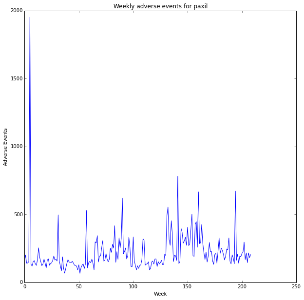
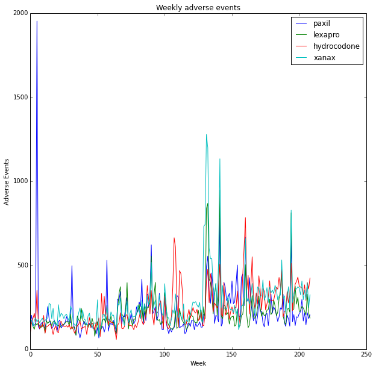
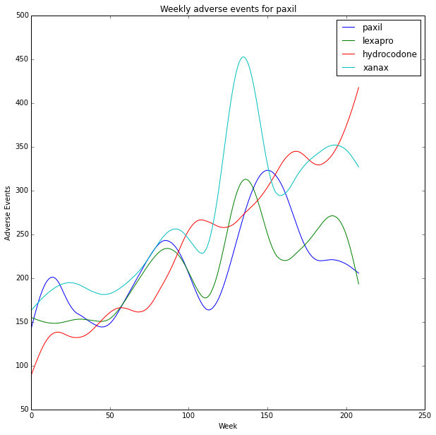
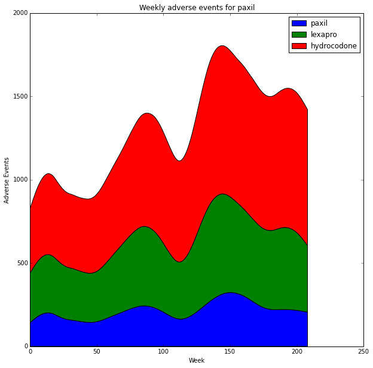
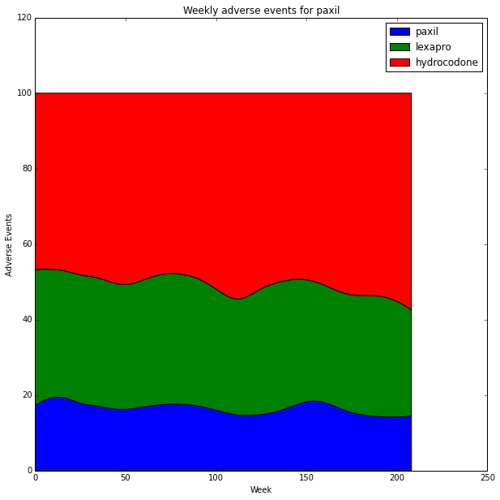

# Introduction

In this example we'll be using the OpenFDA API to retrieve and plot data sampled at many time periods. We will show some plot types that are useful for near continuous data with hundreds of samples.

We will use the openFDA API again to retrieve adverse event data for a number of drugs. Data will be retrieved for every week over a period of four years. This means there will be over 200 datapoints. We then show how to.

<ul>
<li><strong>plot line profiles</strong></li>
<li><strong>use a smoothing function to reduce noise in the data</strong></li>
<li><strong>use a stacked area chart to show relative and absolute trends</strong></li>
<li><strong>use a 100% stacked area chart to emphasize uncorrelated trends</strong></li>
</ul>

As usual we start by importing the libraries we will need to use.

<pre>import pandas as pd
import numpy as np
import json as js
import urllib2 as ulib
import simplejson
import matplotlib.pyplot as plt
from operator import itemgetter
import datetime</pre>

<pre>/usr/local/lib/python2.7/dist-packages/pandas/io/excel.py:626: UserWarning: Installed openpyxl is not supported at this time. Use &gt;=1.6.1 and &lt;2.0.0.
  .format(openpyxl_compat.start_ver, openpyxl_compat.stop_ver))
</pre>

We also tell the notebook to render inline

<pre>%matplotlib inline </pre>

We start by defining a list of drugs to investigate. Here we also define a standard figure size. If we want to investigate different drugs later, or change the size of the figures we can come back and change this block.

<pre>#define a list of drugs to investigate
drugs=[&#39;paxil&#39;, &#39;lexapro&#39;, &#39;hydrocodone&#39;, &#39;xanax&#39;]

figsize=[10,10]</pre>

We want to create a function to get adverse event data that has been reported within a specific time period. To do this we need to use more features of the OpenFDA API (https://open.fda.gov/drug/event/). Specifically we want to use the receivedate field to specify a time range to retrieve data for. First we write and test a block that retrieves adverse event data between two time periods.

<pre>drugname=&#39;Aspirin&#39;
start_date=&#39;2009-10-1&#39;
end_date=&#39;2010-10-1&#39;

request_string=&#39;https://api.fda.gov/drug/event.json?&amp;search=patient.drug.medicinalproduct:&#39;+str(drugname)+&#39;+AND+receivedate:[&#39;+str(start_date)+&#39;+TO+&#39;+str(end_date)+&#39;]&amp;count=patient.reaction.reactionmeddrapt.exact&#39;
    
request=ulib.Request(request_string)

# open the url
opener = ulib.build_opener()
f = opener.open(request)

# load as json
fda_data=simplejson.load(f)

for i in range(0, 5):
    print fda_data[&#39;results&#39;][i]</pre>

<pre>{&#39;count&#39;: 2863, &#39;term&#39;: &#39;FLUSHING&#39;}
{&#39;count&#39;: 1238, &#39;term&#39;: &#39;PRURITUS&#39;}
{&#39;count&#39;: 1142, &#39;term&#39;: &#39;NAUSEA&#39;}
{&#39;count&#39;: 995, &#39;term&#39;: &#39;DIZZINESS&#39;}
{&#39;count&#39;: 950, &#39;term&#39;: &#39;DYSPNOEA&#39;}
</pre>

Once we learn how to retrieve data by time period we put the code into a function so we can re-use it. It's a good idea to document the function with a small description of the overall purpose and the type and purpose of the inputs and outputs. So let's do that.

<code>get_event_data</code>

Description: Forms a request string and asks the openFDA API for adverse event info for a drug between two dates.

Inputs:

<ul>
<li><code>drugname</code>: String, name of drug</li>
<li><code>start_date</code>: String representing a date in Y-m-d format. </li>
<li><code>end_date</code>: String representing a data in Y-m-d format.</li>
</ul>

Return Value: JSON structure representing adverse event info reported for a drug between the start and end dates.

<pre>def get_event_data(drugname, start_date, end_date):
    # form a request
    api_key=&#39;6OcOelyLSQYJAZlZ8C1XggprPQ5oBx8171k9z0aP&#39;
    
    request_string=&#39;https://api.fda.gov/drug/event.json?api_key=&#39;+api_key+&#39;&amp;search=patient.drug.medicinalproduct:&#39;+str(drugname)+&#39;+AND+receivedate:[&#39;+str(start_date)+&#39;+TO+&#39;+str(end_date)+&#39;]&amp;count=patient.reaction.reactionmeddrapt.exact&#39;
    
    request=ulib.Request(request_string)

    # open the url
    opener = ulib.build_opener()
    f = opener.open(request)

    # load as json
    fda_data=simplejson.load(f)
    
    # return the results
    return fda_data[&#39;results&#39;]</pre>

We also define a function to calculate the sum total of all adverse events contained in an event list.

<pre>def get_total_adverse_events(event_list):
    total=0
    for event_info in event_list:
        total+=event_info[&#39;count&#39;]
    return total</pre>

This next step is optional. Note the data has previously been saved in the file drug_events.json.

We first define a list of drugs and loop through them. Then we want to loop through several years of data. To achieve this we define a start date then loop, incrementing the date by 1 week until we reach the year 2012. This means we will retrieve data for the years 2008 through 2011 on a weekly basis. For each week we call the function to request the adverse event data and the function to calculate the total number of adverse events. We then save the data to a dictionary using the drug name as the key.

Note: In the loop we call the API over 200 times for four different drugs. Thus 800 api calls are made. OpenFDA has a limit of 240 calls per minute. Depending on the speed of connection this loop may violate the api call limit.

<pre>drug_dictionary={}

#for each drug create an empty dictionary
for drug in drugs:

    start= datetime.datetime(2008, 01, 01)
    delta =  datetime.timedelta(weeks=1)
    stop = start+delta

    data=[]
    i=0;

    while start.year&lt;2012:
        eventlist=get_drug_data(drug, start.strftime(&#39;%Y-%m-%d&#39;), stop.strftime(&#39;%Y-%m-%d&#39;))
        total=get_total_adverse_events(eventlist)
        print str(start)+&#34; &#34;+str(total)
        year=start.year
        entry={}
        
        entry[&#39;event_count&#39;]=total
        entry[&#39;date&#39;]=start
        data.append(entry)
        i=i+1
        start=stop
        stop=start+delta
        
    drug_dictionary[drug]=data</pre>

Here we save the data using the json format. This is important. Retreiving large amounts of data can be time consuming and error prone. The API might not be reachable next time, or may change. We could demo our software at a new site, on a different network and a firewall could prevent us from connecting. So it is a good idea to save the data locally and only use the API if we want to rerieve data using different parameters.

<pre>with open(&#39;drug_events.json&#39;, &#39;wb&#39;) as fp:
    js.dump(drug_dictionary, fp)
    
fp.close()</pre>

If you did not generate the data using the openFDA api you can open the data at this step. If you did generate the data and save it, it is good practice to reopen it and verify the file saved properly.

<pre>with open(&#39;drug_events.json&#39;, &#39;rb&#39;) as fp:
    data = js.load(fp)</pre>

We need a function to smooth our data. This one is taken from the scipy cookbook. A complete explation of the function is beyond the scope of this lesson but can be found here http://wiki.scipy.org/Cookbook/SignalSmooth.

<pre>def smooth(x,window_len=11,window=&#39;hanning&#39;):
        if x.ndim != 1:
                raise ValueError, &#34;smooth only accepts 1 dimension arrays.&#34;
        if x.size &lt; window_len:
                raise ValueError, &#34;Input vector needs to be bigger than window size.&#34;
        if window_len&lt;3:
                return x
        if not window in [&#39;flat&#39;, &#39;hanning&#39;, &#39;hamming&#39;, &#39;bartlett&#39;, &#39;blackman&#39;]:
                raise ValueError, &#34;Window is on of &#39;flat&#39;, &#39;hanning&#39;, &#39;hamming&#39;, &#39;bartlett&#39;, &#39;blackman&#39;&#34;
        s=np.r_[2*x[0]-x[window_len-1::-1],x,2*x[-1]-x[-1:-window_len:-1]]
        if window == &#39;flat&#39;: #moving average
                w=np.ones(window_len,&#39;d&#39;)
        else:  
                w=eval(&#39;np.&#39;+window+&#39;(window_len)&#39;)
        y=np.convolve(w/w.sum(),s,mode=&#39;same&#39;)
        return y[window_len:-window_len+1]</pre>

Now that we have the data let's start plotting. First we'll create a simple line plot. Before plotting we need to check what type of data we have. We should have a dictionary where the keys are drug names. So lets verify that.

<pre>print type(data)

for key, value in data.iteritems() :
    print key</pre>

<pre>&lt;type &#39;dict&#39;&gt;
paxil
hydrocodone
lexapro
xanax
</pre>

We stored the drug names as a list. This was done to make it easy to analyze data for a different set of drugs (we only have to change the list). For each drug we stored a list of dictionaries with keys 'date' and 'event_count'. It can be a bit confusing so once again lets verify the data is as expected.

<pre>print type(data[drugs[0]])
print type(data[drugs[0]][0])

for key, value in data[drugs[0]][0].iteritems():
    print key</pre>

<pre>&lt;type &#39;list&#39;&gt;
&lt;type &#39;dict&#39;&gt;
date
event_count
</pre>

To plot the data we need to convert the list of dictionary entries to a list of numbers. So lets do that for the first drug and plot the data. We use the numpy 'arange' function to create x axis values based on the length of our y data.

<pre>drug_name=drugs[0]

y=[]

for entry in data[drug_name]:
        y.append( entry[&#39;event_count&#39;] )

x=np.arange(len(y))
plt.plot(x, y)
plt.title(&#39;Weekly adverse events for &#39;+drug_name)
plt.ylabel(&#39;Adverse Events&#39;)
plt.xlabel(&#39;Week&#39;)

fig=plt.gcf()
fig.set_size_inches(figsize)
plt.show()</pre>

<pre>

</pre>

We can also loop and create a line graph for all the drugs. Notice that we pass a third input to the plot function called 'label'. By passing in a label we create an association between each line style and that label which is later used when rendering the legend.

<pre>for drug in drugs:
    event_list=[]
    for entry in data[drug]:
        event_list.append( entry[&#39;event_count&#39;] )
    x=np.arange(len(event_list))
    plt.plot(x, event_list, label=drug)
    
plt.title(&#39;Weekly adverse events&#39;)
plt.ylabel(&#39;Adverse Events&#39;)
plt.xlabel(&#39;Week&#39;)

fig=plt.gcf()
fig.set_size_inches(figsize)
plt.legend()
plt.show()</pre>

<pre>

</pre>

The data is very noisy with spikes that appear correlated. This time we smooth the data before plotting.

<pre>for drug in drugs:
    event_list=[]
    for entry in data[drug]:
        event_list.append( entry[&#39;event_count&#39;] )
    smoothed=smooth(np.array(event_list),50)
    x=np.arange(len(smoothed))
    plt.plot(x, smoothed, label=drug)
    
plt.title(&#39;Weekly adverse events for &#39;+drug_name)
plt.ylabel(&#39;Adverse Events&#39;)
plt.xlabel(&#39;Week&#39;)
plt.legend()

fig=plt.gcf()
fig.set_size_inches(figsize)
plt.show()</pre>

<pre>

</pre>

It can be a bit difficult to perceive relative changes between the plots. We can use a stacked area chart to look at relative and absolute differences. (http://stackoverflow.com/questions/2225995/how-can-i-create-stacked-line-graph-with-matplotlib). It's a bit tricky to get the legend to appear properly but it's covered in this stack-overflow question http://stackoverflow.com/questions/20336881/matplotlib-stackplot-legend-error.

<pre>import matplotlib.patches as mpatches

fig = plt.figure()
ax1 = fig.add_subplot(111)

y=np.row_stack(( np.array(smoothed_data[drugs[0]]), np.array(smoothed_data[drugs[1]]), np.array(smoothed_data[drugs[2]])))

y_stack=np.cumsum(y, axis=0)

x=np.arange(len(smoothed_data[drugs[0]]))

stacks=ax1.stackplot(x, y_stack, label=drugs)

plt.title(&#39;Weekly adverse events for &#39;+drug_name)
plt.ylabel(&#39;Adverse Events&#39;)
plt.xlabel(&#39;Week&#39;)

proxy_rects = [mpatches.Rectangle((0, 0), 1, 1, fc=pc.get_facecolor()[0]) for pc in stacks]
ax1.legend(proxy_rects, drugs)

fig=plt.gcf()
fig.set_size_inches(figsize)

plt.show()</pre>

<pre>

</pre>

We can use a stacked 100% area chart to look at only relative differences. In this case the 100% stacked area chart is very useful since the data has correlated peaks. The stacked 100% area chart emphasizes uncorrelated trends. http://stackoverflow.com/questions/16875546/create-a-100-stacked-area-chart-with-matplotlib

<pre>percent = y_stack /  y_stack.sum(axis=0).astype(float) * 100 

fig = plt.figure()
ax1 = fig.add_subplot(111)

ax1.stackplot(x, percent)

plt.title(&#39;Weekly adverse events for &#39;+drug_name)
plt.ylabel(&#39;Adverse Events&#39;)
plt.xlabel(&#39;Week&#39;)

proxy_rects = [mpatches.Rectangle((0, 0), 1, 1, fc=pc.get_facecolor()[0]) for pc in stacks]
ax1.legend(proxy_rects, drugs)

fig=plt.gcf()
fig.set_size_inches(figsize)

plt.show()</pre>

<pre>

</pre>

<pre></pre>

