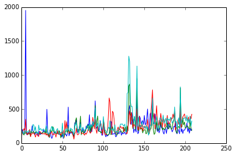
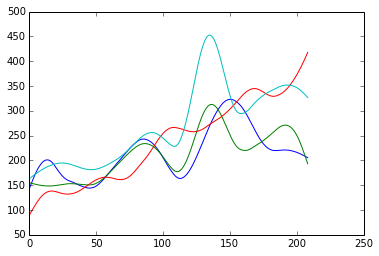
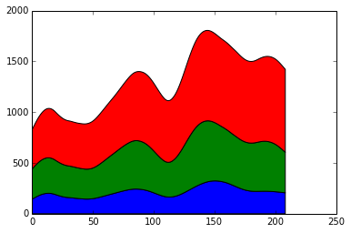
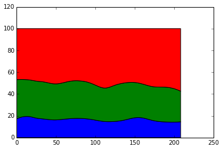

# Introduction

In this example we use line charts and area charts to graph data sampled at many time periods.

<pre>import pandas as pd
import numpy as np
import json as js
import urllib2 as ulib
import simplejson
import matplotlib.pyplot as plt
from operator import itemgetter
import datetime

%matplotlib inline </pre>

Define a function to get adverse event data that has been reported within a specific time period.

<pre>def get_event_data(drugname, start_date, end_date):
    # form a request
    
    api_key=&#39;6OcOelyLSQYJAZlZ8C1XggprPQ5oBx8171k9z0aP&#39;
    
    #request_string=&#39;http://api.fda.gov/drug/event.json?search=patient.drug.medicinalproduct:&#39;+drugname+&#39;+AND+receivedate:[2012-01-01+TO+2012-12-31]&amp;count=patient.reaction.reactionmeddrapt.exact&#39;
    request_string=&#39;https://api.fda.gov/drug/event.json?api_key=&#39;+api_key+&#39;&amp;search=patient.drug.medicinalproduct:&#39;+str(drugname)+&#39;+AND+receivedate:[&#39;+str(start_date)+&#39;+TO+&#39;+str(end_date)+&#39;]&amp;count=patient.reaction.reactionmeddrapt.exact&#39;
    
    request=ulib.Request(request_string)

    # open the url
    opener = ulib.build_opener()
    f = opener.open(request)

    # load as json
    fda_data=simplejson.load(f)
    
    # return the results
    return fda_data[&#39;results&#39;]</pre>

Define a function to return the total number of adverse events that were reported.

<pre>def get_total_adverse_events(event_list):
    total=0
    for event_info in event_list:
        total+=event_info[&#39;count&#39;]
    return total</pre>

This step is optional because the data has allready been saved. We first loop through several drugs. Then we loop through several years of data with a stepsize of 1 week. For each week we call the function to request the adverse event data and the function to calculate the total number of adverse events. We save the data to a dictionary.

Note: In the loop we call the API over 200 times for four different drugs. Thus 800 api calls are made. OpenFDA has a limit of 240 calls per minute. Depending on the speed of connection this loop may violate the api call limit.

<pre>#define a list of drugs to investigate
drugs=[&#39;paxil&#39;, &#39;lexapro&#39;, &#39;hydrocodone&#39;, &#39;xanax&#39;]

drug_dictionary={}

#for each drug create an empty dictionary
for drug in drugs:

    start= datetime.datetime(2008, 01, 01)
    delta =  datetime.timedelta(weeks=1)
    stop = start+delta

    data=[]
    i=0;

    while start.year&lt;2012:
        eventlist=get_drug_data(drug, start.strftime(&#39;%Y-%m-%d&#39;), stop.strftime(&#39;%Y-%m-%d&#39;))
        total=get_total_adverse_events(eventlist)
        print str(start)+&#34; &#34;+str(total)
        year=start.year
        entry={}
        
        entry[&#39;event_count&#39;]=total
        entry[&#39;date&#39;]=start
        data.append(entry)
        i=i+1
        start=stop
        stop=start+delta
        
    drug_dictionary[drug]=data</pre>

Save the data using the json format.

<pre>import json
with open(&#39;drug_events.json&#39;, &#39;wb&#39;) as fp:
    json.dump(drug_dictionary, fp)
    
fp.close()</pre>

Open the adverse event data. The data has been pre-saved and provided with the lesson (for the case the api calls above failed)

<pre>with open(&#39;drug_events.json&#39;, &#39;rb&#39;) as fp:
    data = json.load(fp)</pre>

We need a function to smooth our data. This one is taken from the scipy cookbook http://wiki.scipy.org/Cookbook/SignalSmooth

<pre>def smooth(x,window_len=11,window=&#39;hanning&#39;):
        if x.ndim != 1:
                raise ValueError, &#34;smooth only accepts 1 dimension arrays.&#34;
        if x.size &lt; window_len:
                raise ValueError, &#34;Input vector needs to be bigger than window size.&#34;
        if window_len&lt;3:
                return x
        if not window in [&#39;flat&#39;, &#39;hanning&#39;, &#39;hamming&#39;, &#39;bartlett&#39;, &#39;blackman&#39;]:
                raise ValueError, &#34;Window is on of &#39;flat&#39;, &#39;hanning&#39;, &#39;hamming&#39;, &#39;bartlett&#39;, &#39;blackman&#39;&#34;
        s=np.r_[2*x[0]-x[window_len-1::-1],x,2*x[-1]-x[-1:-window_len:-1]]
        if window == &#39;flat&#39;: #moving average
                w=np.ones(window_len,&#39;d&#39;)
        else:  
                w=eval(&#39;np.&#39;+window+&#39;(window_len)&#39;)
        y=np.convolve(w/w.sum(),s,mode=&#39;same&#39;)
        return y[window_len:-window_len+1]</pre>

First lets plot the data using a straight forward line chart.

<pre>smoothed_data={}

for drug in drugs:
    event_list=[]
    #&#39;lexapro&#39;, &#39;hydrocodone&#39;
    for entry in data[drug]:
        event_list.append( entry[&#39;event_count&#39;] )
    x=np.arange(len(event_list))
    plt.plot(x, event_list)
    smoothed_data[drug]=smooth(np.array(event_list),50)
</pre>

<pre>

</pre>

The data is very noisy with spikes that appear correlated (TODO: Double check and make sure the data was downloaded properly, if so brainstorm explanations for the spikes). Smooth the data and plot again.

<pre>for drug in drugs:
    smoothed=smoothed_data[drug]
    x=np.arange(len(smoothed))
    plt.plot(x, smoothed)</pre>

<pre>

</pre>

Stacked area chart to look at relative and absolute differences. (http://stackoverflow.com/questions/2225995/how-can-i-create-stacked-line-graph-with-matplotlib)

<pre>fig = plt.figure()
ax1 = fig.add_subplot(111)

y=np.row_stack(( np.array(smoothed_data[drugs[0]]), np.array(smoothed_data[drugs[1]]), np.array(smoothed_data[drugs[2]])))

y_stack=np.cumsum(y, axis=0)

x=np.arange(len(smoothed_data[drugs[0]]))

ax1.stackplot(x, y_stack)
</pre>

<pre>[&lt;matplotlib.collections.PolyCollection at 0x7f88e7807350&gt;,
 &lt;matplotlib.collections.PolyCollection at 0x7f88e77c2bd0&gt;,
 &lt;matplotlib.collections.PolyCollection at 0x7f88e77c2590&gt;]

</pre>

Stacked 100% area chart to look at only relative differences. In this case the 100% stacked area chart is very useful since the data has correlated peaks. http://stackoverflow.com/questions/16875546/create-a-100-stacked-area-chart-with-matplotlib

<pre>percent = y_stack /  y_stack.sum(axis=0).astype(float) * 100 

fig = plt.figure()
ax1 = fig.add_subplot(111)

ax1.stackplot(x, percent)</pre>

<pre>[&lt;matplotlib.collections.PolyCollection at 0x7f88e777fa10&gt;,
 &lt;matplotlib.collections.PolyCollection at 0x7f88e777ff10&gt;,
 &lt;matplotlib.collections.PolyCollection at 0x7f88e76cf790&gt;]

</pre>

