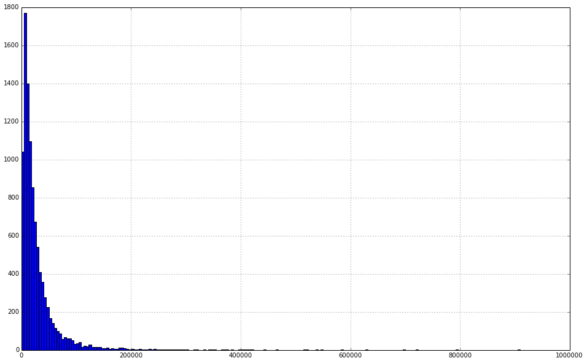
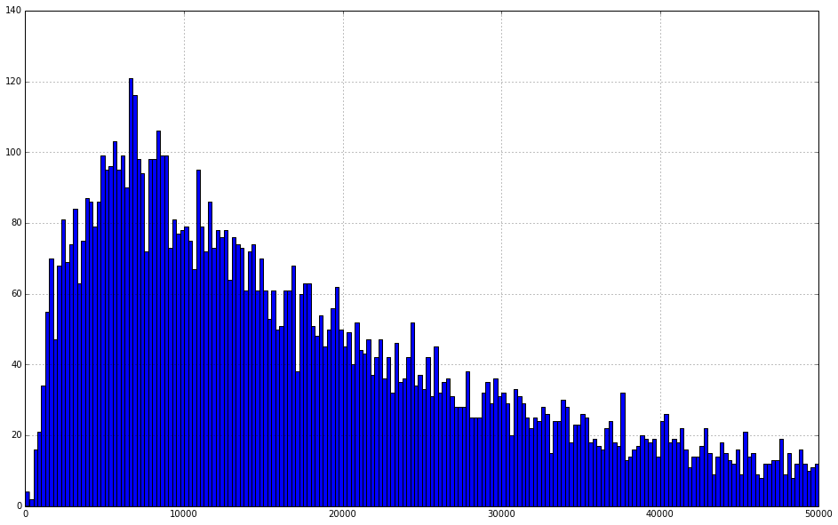
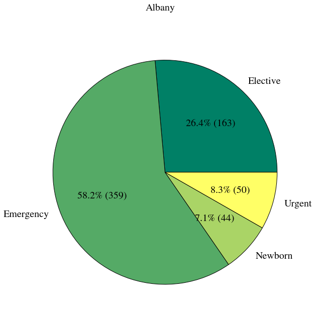
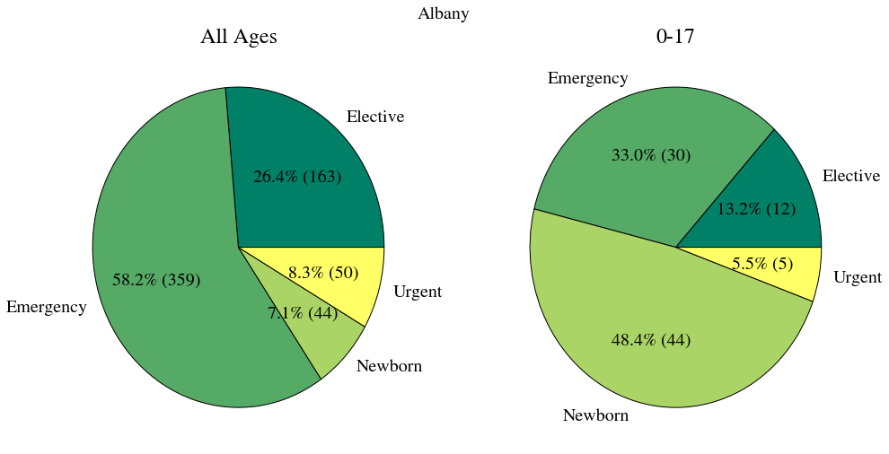
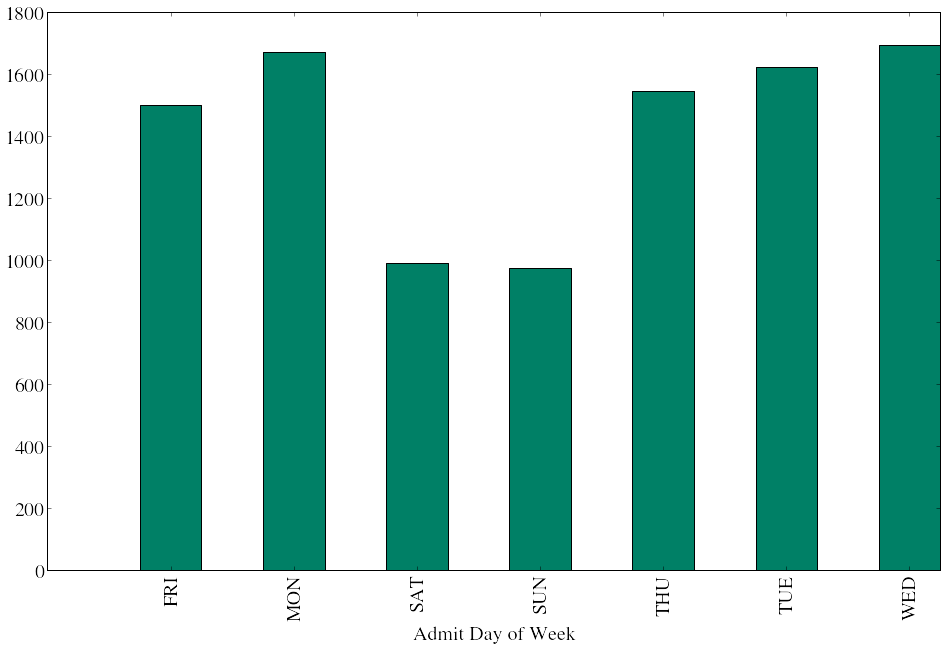
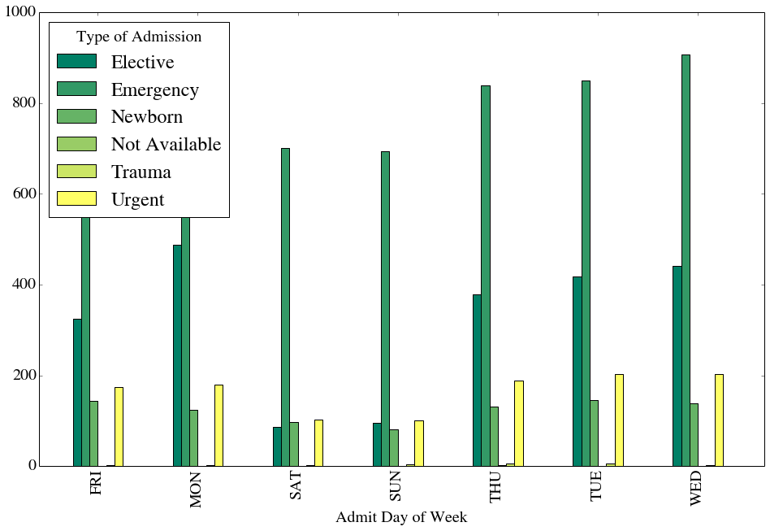

# Introduction

For this tutorial we'll be looking at a sample of dischage information containing de-identified patient information, hospital information, services rendered by the hospitals and billing information.

We want to:

<ul>
<li>Load the data using pandas</li>
<li>Clean the data so we can work with it</li>
<li>Produce Histograms of the Total Charges</li>
<li>See how we can &quot;zoom in&quot; on the data to identify areas of interest</li>
</ul>

<h4 id="objectives">Objectives</h4>
<ul>
<li>Learn how to use the &quot;apply&quot; function to make changes to the data in a column</li>
<li>Learn how to call matplotlib functions from panda objects</li>
<li>Learn how to use pandas binary vectors to select subsets of data</li>
<li>learn some basic uses of the groupby function to manipulate your data</li>
</ul>

To begin we import the libraries we'll be needing today, including the pylab submodule (named 'plt' for short) and pandas (renamed 'pd' to make typing easier). Additionally we include the <code>%matplotlib inline</code> statement to ensure our plots show up on the webpage.

<pre>%matplotlib inline

from matplotlib import pylab as plt
import pandas as pd</pre>

<pre>/usr/local/lib/python2.7/dist-packages/pandas/io/excel.py:626: UserWarning: Installed openpyxl is not supported at this time. Use &gt;=1.6.1 and &lt;2.0.0.
  .format(openpyxl_compat.start_ver, openpyxl_compat.stop_ver))
</pre>

Now we load the discharge information into our dataset by using panda's <code>read_csv()</code> function. This will load all the information along with the header and provide us with a variable <code>df</code> that we can use to manipulate the data and generate our plots.

<pre>df = pd.read_csv(&#34;discharges.csv&#34;)</pre>

## Cleaning Data

Right now we're primarily interested in Total Charges, but before we can start asking interesting questions about total charges and plotting its distribution we need to resolve a data cleanliness issue. Lets see what is in the 'Total Charges' column

<pre>df[&#39;Total Charges&#39;]</pre>

<pre>0     $62328.96
1     $30063.34
2     $14315.22
3     $32244.05
4     $28109.18
5     $21159.98
6      $8800.68
7     $71088.71
8     $18795.74
9      $5931.00
10    $29129.62
11    $41506.95
12    $42735.52
13    $12221.78
14    $12417.50
...
9985    $16147.25
9986     $4430.25
9987     $7625.00
9988    $27442.00
9989     $8311.00
9990     $6299.25
9991    $10041.75
9992    $15825.75
9993     $8662.50
9994     $4422.00
9995     $8134.25
9996    $18369.50
9997     $1895.25
9998    $10532.75
9999    $11569.50
Name: Total Charges, Length: 10000, dtype: object</pre>

Total Charges contains dollar values for the services rendered to the patient while at the hospital. Unfortunately the data currently includes the dollar sign ($). This leads to some difficult problems when trying to add, subtract or do any other kind of operation on these values.

As an example lets take the the <strong>first</strong> value of Total Charges (<code>df['Total Charges'].iloc[0]</code>) and add it to the <strong>second</strong> value of Total Charges (<code>df['Total Charges'].iloc[1]</code>). (<code>iloc</code> is a method, supported by panda objects, that can be used to index an axis by an integer.)

<pre>df[&#39;Total Charges&#39;].iloc[0] + df[&#39;Total Charges&#39;].iloc[1]</pre>

<pre>&#39;$62328.96$30063.34&#39;</pre>

This is certainly not what we want! But what is going on here?

Instead of adding the <em>numbers</em> 62328.96 and 30063.34 Python has gone ahead and appended the <em>strings</em> $62328.96 and $30063.34. If we want to do any kind of plotting or take any kind of summary statistics we're going to need to convert the strings contained in Total Charges to actual numbers.

From a high level this means 1. removing the dollar sign ($) from our string 2. converting the <em>type</em> of the variable from a string to a number 3. Doing this for every variable in the 'Total Charges' column.

To achieve this practically we're going to write a function that takes a string like $62328.96 and converts it to a number 62328.96. Then we're going to apply that function to each of the cells in the 'Total Charges' column. That is the purpose of functions, to take an input and return a transformed output. In this case our input is total charge as a string and our output will be total charge as a number.

Lets take a look at some of the building blocks we'll need.

Replace is a function that we can use to return a new string which replaces certain characters with other characters. It takes two arguments, the first is the string to look for, the second is the string to replace with. In this case we replace with the empty string. Lets see an example of this:

<pre>&#34;$62328.96&#34;.replace(&#34;$&#34;, &#34;&#34;)</pre>

<pre>&#39;62328.96&#39;</pre>

This is a good start, we've deleted the dollar sign ($) by &quot;replacing&quot; it with the empty string. Unfortunately this is not enough! our &quot;number&quot; is still considered a string, if we try and add two replaced strings we're still in the same situation:

<pre>&#34;$62528.96&#34;.replace(&#34;$&#34;, &#34;&#34;) + &#34;$30063.34&#34;.replace(&#34;$&#34;, &#34;&#34;)</pre>

<pre>&#39;62528.9630063.34&#39;</pre>

Here we've removed the dollar signs ($) from each string and tried to add them together. Python still sees these as two strings, and this can be an easy point to miss. We need to tell python that these two 'strings' are actually numbers. For numbers that have floating point decimals we do this with the <code>float()</code> function.

<pre>float(&#39;62528.96&#39;)</pre>

<pre>62528.96</pre>

Putting them both together

<pre>float(&#39;$62528.96&#39;.replace(&#34;$&#34;, &#34;&#34;))</pre>

<pre>62528.96</pre>

<h5 id="making-it-general">Making it General</h5>

We get the number that we expect. This is all well and good, but we'd like to be able to convert <strong>any</strong> string with a dollar sign to a floating point number. To do this we need a function:

<pre>def translate_charge(string_charge):
    return float(string_charge.replace(&#34;$&#34;, &#34;&#34;))</pre>

Now we can pass any value to our function <code>translate_charge</code> and it will replace the dollar sign ($) and return the number

<pre>translate_charge(&#34;$62528.96&#34;)</pre>

<pre>62528.96</pre>

We can even get the addition we were looking for before

<pre>translate_charge(&#34;$62528.96&#34;) + translate_charge(&#34;$30063.34&#34;)</pre>

<pre>92592.3</pre>

Now we just need to call this function on every value in 'Total Charges.' Luckily pandas has a very simple function that allows us to apply this function to each value. Not surprisingly it is called <code>apply</code>

<pre>df[&#39;Total Charges&#39;].apply(translate_charge)</pre>

<pre>0     62328.96
1     30063.34
2     14315.22
3     32244.05
4     28109.18
5     21159.98
6      8800.68
7     71088.71
8     18795.74
9      5931.00
10    29129.62
11    41506.95
12    42735.52
13    12221.78
14    12417.50
...
9985    16147.25
9986     4430.25
9987     7625.00
9988    27442.00
9989     8311.00
9990     6299.25
9991    10041.75
9992    15825.75
9993     8662.50
9994     4422.00
9995     8134.25
9996    18369.50
9997     1895.25
9998    10532.75
9999    11569.50
Name: Total Charges, Length: 10000, dtype: float64</pre>

Careful though, because <code>apply</code> will not change <code>df['Total Charges']</code> it will just return a new column. If you want to keep that column you have to set Total Charges equal to it.

<pre>df[&#39;Total Charges&#39;] = df[&#39;Total Charges&#39;].apply(translate_charge)</pre>

## Investigating the Data using histograms

Now that we have cleaned up Total Charges and have proper numbers for values, we can start looking at some of the summary statistics for our sample. The quickest way to do this is to use the <code>describe()</code> function. This gives us the count, mean, the standard deviation and the min and max.

<pre>df[&#39;Total Charges&#39;].describe()</pre>

<pre>count     10000.000000
mean      28917.608244
std       42960.967530
min           8.500000
25%        8322.365000
50%       16885.315000
75%       33265.787500
max      909834.270000
dtype: float64</pre>

We can use the <code>hist</code> function to plot a histogram of our data to get a better sense of our distribution. Note that panda data series support the <code>hist</code> method (among other plotting functions). The method draws a histogram using matplotlib and using itself as the input data. <code>hist</code> takes an argument <code>bins</code> to determine the number of bins we want to display. Finally we can use the argument <code>figsize</code> to increase the size of the figure.

<pre>df[&#39;Total Charges&#39;].hist(bins=200, figsize=(16.0, 10.0))</pre>

<pre>&lt;matplotlib.axes.AxesSubplot at 0x3f220d0&gt;

</pre>

<h5 id="zooming-in">Zooming In</h5>

This looks like a distribution with a pretty long tail. This makes it hard to see exactly what is going on around the mean of the distribution. What we'd really like to be able to do is to &quot;zoom in&quot; and see the distribution without some of these outliers.

To do this we're going to use binary vectors to select subsets of the data we want.

Binary vectors are just columns of data that contain either True or False. We can generate these vectors by comparing columns to values. For example:

<pre>df[&#39;Total Charges&#39;] &lt; 50000</pre>

<pre>0     False
1      True
2      True
3      True
4      True
5      True
6      True
7     False
8      True
9      True
10     True
11     True
12     True
13     True
14     True
...
9985    True
9986    True
9987    True
9988    True
9989    True
9990    True
9991    True
9992    True
9993    True
9994    True
9995    True
9996    True
9997    True
9998    True
9999    True
Name: Total Charges, Length: 10000, dtype: bool</pre>

This simple operation has compared each cell in Total Charges to the value 50,000. If the value is less than 50,000 it gives a True, otherwise it gives a False. Once we have this I can use this selector to grab only the values that are True (meet our condition)

<pre>selector = df[&#39;Total Charges&#39;] &lt; 50000
df[&#39;Total Charges&#39;][selector].hist(bins=200 ,figsize=(16., 10.))</pre>

<pre>&lt;matplotlib.axes.AxesSubplot at 0x3f22b10&gt;

</pre>

## Investigating the Data using a Pie Chart

In this example we are going to plot the data using a pie chart. First we want to take a look at the organization of our data. We use pprint (which stands for &quot;pretty print&quot;) to print the columns of the dataframe.

<pre>from pprint import pprint
pprint(list(df.columns))</pre>

<pre>[&#39;Unnamed: 0&#39;,
 &#39;Hospital Service Area&#39;,
 &#39;Hospital County&#39;,
 &#39;Operating Certificate Number&#39;,
 &#39;Facility Id&#39;,
 &#39;Facility Name&#39;,
 &#39;Age Group&#39;,
 &#39;Zip Code - 3 digits&#39;,
 &#39;Gender&#39;,
 &#39;Race&#39;,
 &#39;Ethnicity&#39;,
 &#39;Length of Stay&#39;,
 &#39;Admit Day of Week&#39;,
 &#39;Type of Admission&#39;,
 &#39;Patient Disposition&#39;,
 &#39;Discharge Year&#39;,
 &#39;Discharge Day of Week&#39;,
 &#39;CCS Diagnosis Code&#39;,
 &#39;CCS Diagnosis Description&#39;,
 &#39;CCS Procedure Code&#39;,
 &#39;CCS Procedure Description&#39;,
 &#39;APR DRG Code&#39;,
 &#39;APR DRG Description&#39;,
 &#39;APR MDC Code&#39;,
 &#39;APR MDC Description&#39;,
 &#39;APR Severity of Illness Code&#39;,
 &#39;APR Severity of Illness Description&#39;,
 &#39;APR Risk of Mortality&#39;,
 &#39;APR Medical Surgical Description&#39;,
 &#39;Source of Payment 1&#39;,
 &#39;Source of Payment 2&#39;,
 &#39;Source of Payment 3&#39;,
 &#39;Attending Provider License Number&#39;,
 &#39;Operating Provider License Number&#39;,
 &#39;Other Provider License Number&#39;,
 &#39;Birth Weight&#39;,
 &#39;Abortion Edit Indicator&#39;,
 &#39;Emergency Department Indicator&#39;,
 &#39;Total Charges&#39;]
</pre>

Before creating the pie charts we want to learn how to organize the data using the <code>groupby</code> function. <code>groupby</code> returns a <code>DataFrameGroupby</code> object which allows us to retrieve information about the groups (http://pandas.pydata.org/pandas-docs/stable/api.html#groupby). As an example here we create groups by county. We then use the <code>size</code> function to get a series containing the group names (it should be the county names) and the size of each group. We print out the type of the objects and the objects themselves to verify.

<pre>grouped=df.groupby([&#39;Hospital County&#39;])
pprint(type(grouped))
pprint(grouped)

series=grouped.size()

print(type(series))
print(series)
print
print (&#34;Albany data&#34;)
Albany=series[&#39;Albany&#39;]
print(type(Albany))
print(&#34;Size of Albany data:&#34;+str(Albany))</pre>

<pre>&lt;class &#39;pandas.core.groupby.DataFrameGroupBy&#39;&gt;
&lt;pandas.core.groupby.DataFrameGroupBy object at 0x4a03c90&gt;
&lt;class &#39;pandas.core.series.Series&#39;&gt;
Hospital County
Albany              617
Allegheny            21
Broome              299
Cattaraugus          58
Cayuga               57
Chautatuqua         128
Chemung             168
Chenango             20
Clinton              99
Columbia             60
Cortland             49
Delaware             10
Dutchess            323
Erie               1112
Essex                 5
Franklin             59
Fulton               35
Genesee              50
Herkimer              9
Jefferson           120
Lewis                19
Livingston           21
Madison              51
Monroe             1092
Montgomery           65
Nassau             1997
Niagara             211
Oneida              342
Onondaga            803
Ontario             121
Orange              398
Orleans              21
Oswego               61
Otsego              132
Putnam               70
Rensselaer          116
Rockland            357
Saratoga             87
Schenectady         233
Schoharie             5
Schuyler              9
St Lawrence         123
Steuben              19
Suffolk             348
dtype: int64

Albany data
&lt;type &#39;numpy.int64&#39;&gt;
Size of Albany data:617
</pre>

We can also group by 2 categories. Here we group by county and type of admission. Then we use <code>ix</code> (an indexing function) to retrieve the data for Albany county.

<pre>grouped=df.groupby([&#39;Hospital County&#39;, &#39;Type of Admission&#39;]).size()
pprint(type(grouped))

counts = grouped.ix[&#39;Albany&#39;]
print counts</pre>

<pre>&lt;class &#39;pandas.core.series.Series&#39;&gt;
Type of Admission
Elective             163
Emergency            359
Newborn               44
Urgent                51
dtype: int64
</pre>

Before we create our plot lets import the numpy library and the interact widget and also set the font type for our plot.

<pre>import numpy as np
from IPython.html.widgets import interact

plt.rcParams.update({&#39;font.size&#39;: 20, &#39;font.family&#39;: &#39;STIXGeneral&#39;, &#39;mathtext.fontset&#39;: &#39;stix&#39;})</pre>

Now we define a function that draws our plot. We first group by county and type of admission. Then we get the data for the county we are interested in. Finaly we use matplotlib to create a pie chart.

<pre>def by_county(county=&#39;Albany&#39;):
    status_counts = df.groupby([&#39;Hospital County&#39;, &#39;Type of Admission&#39;]).size().ix[county]

    cmap = plt.cm.summer
    colors = cmap(np.linspace(0., 1., len(status_counts)))

    fig, ax = plt.subplots(figsize=(10.0, 10.0))

    ax.pie(status_counts, autopct=lambda p: &#39;{0:.1f}% ({1:})&#39;. format(p, int(p * sum(status_counts) / 100)), 
               labels=status_counts.index, colors=colors)
    fig.suptitle(&#34;{}&#34;.format(county))
    plt.show()</pre>

At this point we've defined a function to draw a plot. But have not actually created a plot. We are going to use the <code>interact</code> function to create an interactive plot. <code>interact</code> takes a function (in this case the <code>by_county</code> function we defined above, and a list of values as inputs. It creates a widget (gui component) using the values of the list. Each time we select a new value from the widget it will call our function thereby redrawing the plot using a different county.

<pre>i = interact(by_county, county=list(df[&#39;Hospital County&#39;].dropna().unique()))</pre>

<pre>

</pre>

In the below example we first take a look at the unique <code>Age Group</code> column. Then we mmodify our function such that we plot a second pie chart containing only the <code>0 to 17</code> data. An advanced excersise would be to add a second widget to the plot, such that one could select the age group of the second plot.

<pre>df[&#39;Age Group&#39;].unique()</pre>

<pre>array([&#39;70 or Older&#39;, &#39;30 to 49&#39;, &#39;0 to 17&#39;, &#39;50 to 69&#39;, &#39;18 to 29&#39;], dtype=object)</pre>

<pre>def by_county_with_0to17(county=&#39;Albany&#39;):
    status_counts = df.groupby([&#39;Hospital County&#39;, &#39;Type of Admission&#39;]).size().ix[county]
    status_counts_17 = df[df[&#39;Age Group&#39;] == &#39;0 to 17&#39;].groupby([&#39;Hospital County&#39;, &#39;Type of Admission&#39;]).size().ix[county]
        
    cmap = plt.cm.summer
    colors = cmap(np.linspace(0., 1., len(status_counts)))

    fig, axs = plt.subplots(1, 2, figsize=(16.0, 8.0))

    axs[0].pie(status_counts, autopct=lambda p: &#39;{0:.1f}% ({1:})&#39;. format(p, int(p * sum(status_counts) / 100)), 
               labels=status_counts.index, colors=colors)
    axs[0].set_title(&#34;All Ages&#34;)
    
    axs[1].pie(status_counts_17, autopct=lambda p: &#39;{0:.1f}% ({1:})&#39;. format(p, int(p * sum(status_counts_17) / 100)), 
               labels=status_counts_17.index, colors=colors)
    axs[1].set_title(&#34;0-17&#34;)
    
    
    fig.suptitle(&#34;{}&#34;.format(county))
    plt.show()

i = interact(by_county_with_0to17, county=list(df[&#39;Hospital County&#39;].dropna().unique()))</pre>

<pre>

</pre>

We can start to see how powerful pandas and matplotlib can be. In this example we use <code>groupby</code> to organize the data by <code>Admit Day of Week</code> then plot a bar graph (using only 1 line of code!).

<pre>df.groupby(&#39;Admit Day of Week&#39;).size().plot(kind=&#34;bar&#34;, figsize=(16.0, 10.0), grid=False, colormap=plt.cm.summer)</pre>

<pre>&lt;matplotlib.axes.AxesSubplot at 0x66f4510&gt;

</pre>

And we can group by 2 columns to create a detailed bar plot of both <code>Admit Day of Week</code> and <code>Type of Admission</code>.

<pre>df.groupby([&#39;Admit Day of Week&#39;, &#39;Type of Admission&#39;]).size().unstack(&#39;Type of Admission&#39;).plot(kind=&#34;bar&#34;, 
                                                                       figsize=(16.0, 10.0), 
                                                                       grid=False, 
                                                                       colormap=plt.cm.summer)</pre>

<pre>&lt;matplotlib.axes.AxesSubplot at 0x5077110&gt;

</pre>

<pre></pre>

